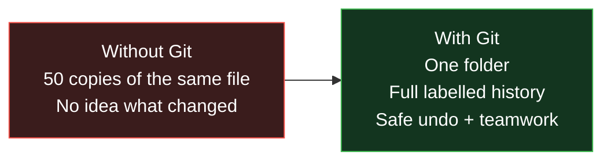
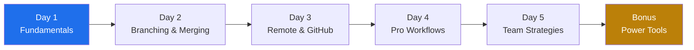

# Git & GitHub Mastery: From Zero to Hero

> **Module 2 of the DevOps Masterclass.** Version control is the foundation everything else is built on. Master this first.

Welcome! This is a hands-on, beginner-friendly course that takes you from *"I've never used Git"* to *"I confidently use Git every day on real teams."* Every concept starts with a **real-world analogy** so it makes sense even if you've never written code.

---

## First, the big picture: what problem does Git solve?

Imagine you're writing an important essay. To stay safe, you start saving copies:

> `essay.docx` → `essay_v2.docx` → `essay_final.docx` → `essay_final_REALLY.docx` → `essay_final_USE_THIS_ONE.docx`

This is chaos. You can't tell what changed, you can't safely undo, and if two friends edit it, merging their work is a nightmare.

**Git is a time machine for your files.** It saves clean, labelled "snapshots" of your project, lets you jump back to any point, try risky ideas safely on a "branch," and merge many people's work together - all in one folder, no messy copies.

---

## Interactive Animations (open in any browser - no install)

These make the trickiest ideas *click*. Open them and play:

| Animation | What it teaches |
|---|---|
| [**Git's Three Trees**](animations/git-three-trees.html) | The single most important Git concept - how files move from *Working Directory → Staging → Repository*. A clickable simulator. |
| [**Branching: Merge vs Rebase**](animations/git-branching.html) | Build a commit history visually, then *see* exactly how merge and rebase differ. |

> Tip for class: project the Three-Trees simulator on screen and let students predict what each button does before you click.

---

## Course Structure

### [Day 1: Git Fundamentals](day1/readme.md) - *Foundation & Core Concepts*
- What version control is (with analogies) • Git vs other systems
- The **three-tree model** (working dir, staging, repository)
- Essential commands: `init`, `add`, `commit`, `status`, `log`
- Writing meaningful commit messages

### [Day 2: Branching & Merging](day2/readme.md) - *Parallel Development*
- What a branch really is (a movable sticky-note, not a copy!)
- Creating/switching branches • fast-forward vs three-way merge
- Resolving merge conflicts calmly • branch hygiene

### [Day 3: Remote Repositories](day3/readme.md) - *Collaboration with GitHub*
- Local vs remote • `clone`, `push`, `pull`, `fetch`
- `origin` vs `upstream` • HTTPS vs SSH authentication
- *(Includes the real-world "Repository not found" / auth troubleshooting we all hit.)*

### [Day 4: Advanced Git](day4/readme.md) - *Professional Workflows*
- Pull requests & code review • forking & contributing
- `stash`, `cherry-pick`, `revert` • **merge vs rebase** deep-dive
- Squash commits • safe force-push (`--force-with-lease`)
- See also: [revert deep-dive](day4/revert.md)

### [Day 5: Team Workflows](day5/readme.md) - *Enterprise Practices*
- **GitHub Flow** vs **GitFlow** ([branching strategy detail](day5/branching-strategy.md))
- Releases, hotfixes, tagging & versioning
- CI/CD integration • repository hygiene

### [Bonus: Git Power Tools](day6-power-tools/readme.md) - *Save Yourself in a Crisis*
- `git reflog` - the undo button for your undo button
- `git bisect` - find the exact commit that broke things
- `git hooks` - automate checks before every commit
- `git stash -p`, `add -p`, aliases, and more lifesavers

---

## Learning Outcomes

By the end you will be able to:
- Explain version control to a non-technical person
- Use Git confidently for daily development
- Collaborate on GitHub (branches, PRs, reviews)
- Handle merge conflicts without panic
- Recover from "I think I broke everything" moments
- Follow industry-standard team workflows

---

## The 10 commands you'll use 90% of the time

| Command | Plain-English meaning |
|---|---|
| `git init` | Start tracking this folder |
| `git status` | What's changed right now? |
| `git add <file>` | Put this change in the "to be saved" box |
| `git commit -m "msg"` | Save a labelled snapshot |
| `git log` | Show the history of snapshots |
| `git branch` | List / create parallel work lines |
| `git switch <branch>` | Move to another work line |
| `git merge <branch>` | Combine another branch into this one |
| `git pull` | Download + merge others' work |
| `git push` | Upload your work to GitHub |

---

## How to use this module
1. **Do, don't just read.** Type every command yourself - muscle memory matters.
2. **Open the animations** when a concept feels abstract.
3. **Break things on purpose** in a throwaway folder, then recover them. That's where confidence comes from.

---

Ready? Start with → [**Day 1: Git Fundamentals**](day1/readme.md)
Next module → [**learn-terraform**](../learn-terraform)
