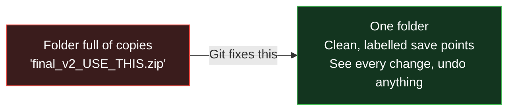
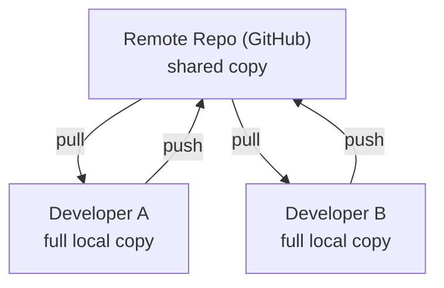
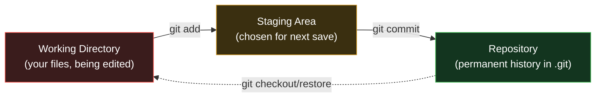
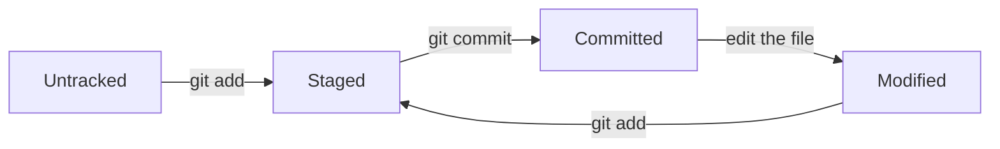
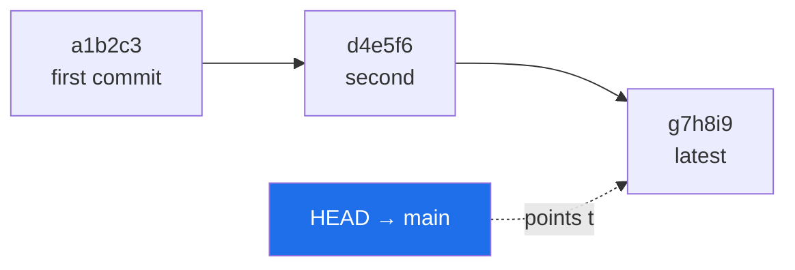

# Day 1 - Git Fundamentals & Local Repository Basics

> **Goal of today:** understand *why* Git exists and confidently save your first versions. We start with everyday analogies - **no coding background needed.**

> **Open while you read:** [Git's Three Trees simulator](../animations/git-three-trees.html) - click through every concept on this page live.

---

## Objective of Day 1

By the end of this session, you will be able to:

- Explain what version control is - to anyone
- Understand how Git works internally (the "three trees")
- Install and set up Git
- Create a local repository
- Track changes, stage them, and commit (save snapshots)
- View history and safely roll back

---

## 1. What is Version Control? (Start here)

### Analogy: the video-game save points

When you play a video game, you **save** at checkpoints. If you make a mistake later, you reload the last save instead of restarting the whole game.

**Version control is a save system for your project files.** Every time you reach a good point, you "save" (called a **commit**). Later you can:
- look back at every save,
- see exactly what changed between saves,
- and reload any earlier save if something breaks.

A **Version Control System (VCS)** is the tool that does this. It tracks:
- **File changes** - what was added, edited, deleted
- **History** - every version, forever
- **Who** changed what
- **When** they changed it

---

### The problem without version control

Most people "version" files by copying them:

```
project_final.zip
project_final_v2.zip
project_final_latest.zip
project_final_latest_USE_THIS.zip
```

This is painful because:
- Files get **overwritten** by accident
- You can't tell **what actually changed** between copies
- Rolling back is guesswork
- Two people editing = **collaboration chaos**



### Benefits of a VCS
- Tracks **every** change automatically
- Keeps the **full history**
- **Easy rollback** to any point
- Safe **team collaboration**
- Acts as a **backup** of your work

---

## 2. Git vs GitHub (a very common confusion)

People mix these up constantly. Here's the simplest way to remember:

### Analogy
- **Git** is like **Microsoft Word** - a program on *your computer* that does the actual work.
- **GitHub** is like **Google Drive** - a *website* where you store and share your files with others.

You can use Git completely offline. GitHub is just one popular place to put your Git projects online (alternatives: GitLab, Bitbucket).

| | **Git** | **GitHub** |
|---|---|---|
| What is it? | A tool (software) | A website (platform) |
| Where? | Installed on your computer | In the cloud |
| Works offline? | Yes | Needs internet |
| Main job | Track versions locally | Host & share repos, collaborate |
| Extra features | - | Pull Requests, code review, issues, CI/CD |

> **One-liner:** *Git is the engine; GitHub is one of many garages you can park it in.*

---

## 3. Distributed Version Control (why Git is special)

### Analogy
Old systems were like a **single library** with one copy of a book - everyone had to go there, and if it burned down, the book was gone.

Git is **distributed**: every developer gets a **complete copy of the entire project and its full history** on their own machine. It's as if everyone owns a full photocopy of the whole library.



**Why this is great:**
- **Fast** - most actions happen locally, no network needed
- **Offline work** - commit on a plane, sync later
- **No single point of failure** - every clone is a full backup

---

## 4. Installing & Setting Up Git

### Install Git
- **Windows:** download from [https://git-scm.com](https://git-scm.com) and install (this also gives you **Git Bash**, a terminal).
- **Mac:** `brew install git` (or it comes with Xcode tools).
- **Linux:** `sudo apt install git` (Debian/Ubuntu).

### Verify it worked
```bash
git --version
```
If you see a version number (e.g. `git version 2.52.0`), you're good.

### Tell Git who you are (one-time setup)
Every save (commit) is stamped with your name and email, so Git needs to know them:
```bash
git config --global user.name "Your Name"
git config --global user.email "your-email@example.com"
```
The `--global` flag means "use this for all my projects." Check your settings anytime:
```bash
git config --list
```

> **Tip:** also set your default branch name to `main`:
> ```bash
> git config --global init.defaultBranch main
> ```

---

## 5. Git Architecture - The Three Trees (the most important concept)

This is the heart of Git. **Master this and everything else becomes easy.**

### Analogy: shipping a parcel
1. **Working Directory** = your **desk**, where you pack and rearrange things (messy, always changing).
2. **Staging Area** = the **box by the door** holding only what you've decided to actually send this time.
3. **Repository** = the **parcel handed to the post office** - sealed, dated, and permanently recorded.



| Tree | What it is | Command to move INTO it |
|---|---|---|
| **Working Directory** | Your actual project folder where you edit | *(just editing files)* |
| **Staging Area** | A "waiting room" for changes you want to save next | `git add` |
| **Repository (.git)** | Permanent, dated snapshots | `git commit` |

> **Do it live:** the [Three Trees simulator](../animations/git-three-trees.html) lets you click *Edit → add → commit* and watch a file travel across all three.

---

## 6. Creating a Repository (`git init`)

To start tracking a folder with Git, go into it and run:
```bash
git init
```
This creates a **hidden `.git` folder** inside your project. That folder *is* your repository - it stores:
- all commit history
- branch information
- configuration

> Never manually edit or delete `.git` unless you know exactly what you're doing - it's the brain of your repo.

---

## 7. Tracking Changes (`git status`)

`git status` is the command you'll run **most often**. It answers: *"What's going on right now?"*
```bash
git status
```
It shows:
- **Untracked** files - brand new, Git isn't watching them yet
- **Modified** files - tracked files you've changed
- **Staged** files - changes ready for the next commit

### The four states a file moves through



---

## 8. Staging & Committing (saving a snapshot)

### Step 1 - Stage your changes
```bash
git add file.txt      # stage one specific file
git add .             # stage ALL changed files in the folder
```

### Step 2 - Commit (seal the snapshot)
```bash
git commit -m "Add login feature"
```
A **commit** is a permanent, labelled snapshot of everything that was staged. The `-m` flag attaches a **message** describing what you did.

### How to write good commit messages
A good message tells future-you (and teammates) *what changed and why*.

| Good | Bad |
|---|---|
| `Add user login validation` | `stuff` |
| `Fix crash when cart is empty` | `fixed` |
| `Update README with setup steps` | `asdf` |

> **Rule of thumb:** finish the sentence *"If applied, this commit will ___."* → "…**Add user login validation**."

---

## 9. Viewing History (`git log`)

```bash
git log                  # full detail: hash, author, date, message
git log --oneline        # compact: one line per commit
git log --oneline --graph --all   # visual branch graph
```
Each commit has a unique **hash** (an ID like `a1b2c3d`) you can use to refer to it later.

---

## 10. HEAD & Commit References

### Analogy
`HEAD` is a **"You Are Here" pin** on a map. It points to the commit you're currently looking at (normally the latest one on your branch).



You can refer to commits *relative* to HEAD:

| Reference | Meaning |
|---|---|
| `HEAD` | The current commit |
| `HEAD~1` | One commit back (the parent) |
| `HEAD~2` | Two commits back |

---

## 11. Rolling Back to Previous Versions

### Just *look* at an old version (temporary)
```bash
git checkout <commit-id>
```
This drops you into a **"detached HEAD"** state - think of it as *time-travelling to look around* without changing anything. Get back to the present with:
```bash
git switch main      # (or: git checkout main)
```

### Safely *undo* a commit (recommended for shared code)
```bash
git revert <commit-id>
```
This creates a **new** commit that reverses the bad one - your history stays honest and nothing is destroyed. (Full deep-dive in [Day 4 revert notes](../day4-advanced-git/revert.md).)

---

## 12. Undoing Changes Safely

| You want to… | Command | What it does |
|---|---|---|
| Discard edits to a file (not yet committed) | `git restore file.txt` | Reverts the file to last commit |
| Unstage a file (keep the edits) | `git restore --staged file.txt` | Moves it out of the staging area |
| Undo the last commit but **keep** the changes | `git reset --soft HEAD~1` | Removes the commit, keeps your work staged |

> [!WARNING]
> `git reset --hard` throws away changes **permanently**. Only use it when you're 100% sure. (And remember: even then, [`git reflog`](../day6-power-tools/notes.md) can often save you.)

---

## Common Beginner Mistakes

1. **Forgetting `git add` before commit** → commit saves *nothing new*. Always check `git status` first.
2. **Committing the wrong files** (passwords, huge files). Use a `.gitignore` file to exclude them.
3. **Vague commit messages** like "update". Future-you will be lost.
4. **Editing inside `.git`** - never do this.

---

## Quick Self-Check

1. In one sentence, what is version control? Give a real-world analogy.
2. What's the difference between Git and GitHub?
3. Name Git's three trees and the command that moves a file into each.
4. What does `git status` tell you?
5. What does `HEAD~2` mean?
6. You committed but want to undo it while keeping your changes - which command?

---

## Hands-On Lab (do this now!)

```bash
mkdir my-first-repo && cd my-first-repo
git init
echo "Hello Git" > hello.txt
git status                       # see 'hello.txt' as untracked
git add hello.txt
git status                       # now it's staged
git commit -m "Add hello.txt"
git log --oneline                # see your first commit!
echo "Second line" >> hello.txt
git add . && git commit -m "Add second line"
git log --oneline                # two commits now
```

---

## End of Day 1 Summary

You can now:
- Create a Git repository (`git init`)
- Track, stage, and commit changes
- View history (`git log`)
- Understand the three trees & HEAD
- Roll back and undo safely

Next up → [**Day 2: Branching & Parallel Development**](../day2-branching-merging/notes.md)
