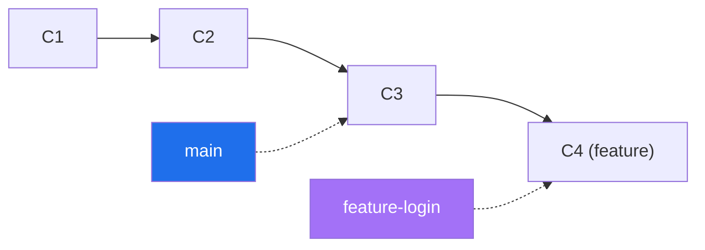
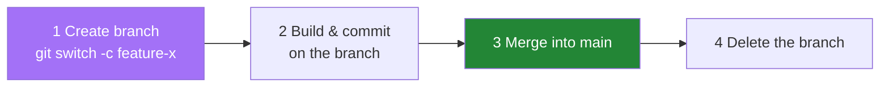
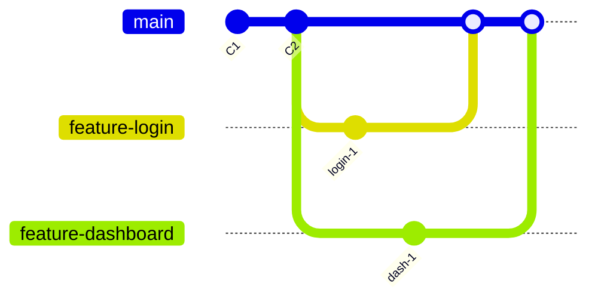
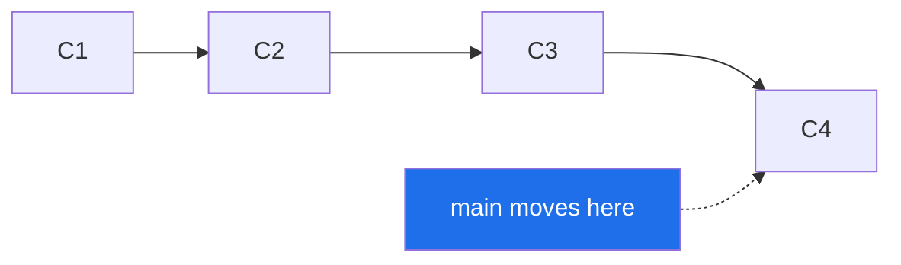
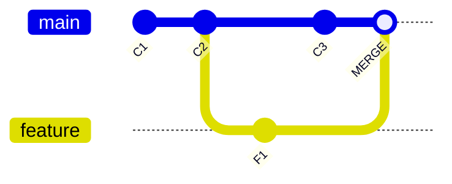

# Day 2 - Branching & Parallel Development Workflow

> **Goal of today:** understand branches - the feature that makes Git powerful for teams. Again, we start with plain-English analogies.

> **Open while you read:** [Branching: Merge vs Rebase](../animations/git-branching.html) - build a commit history visually and watch branches merge.

---

## Objective of Day 2

By the end you will be able to:
- Explain what a branch *really* is (it's not a copy!)
- Create, switch, and delete branches
- Work on multiple features in parallel safely
- Merge branches and understand fast-forward vs three-way merges
- Follow a real-world feature-branch workflow

---

## 1. What is a Branch? (the key idea)

### Analogy: writing a book
You've published a book (your `main` branch - the stable, "live" version). You want to try rewriting Chapter 5, but you don't want to scribble over the published copy in case the new idea is bad.

So you take a **photocopy of your current draft into a separate notebook** and experiment there. If the new Chapter 5 is great, you copy it back into the real book. If it's bad, you just throw the notebook away - the published book was never touched.

**That separate notebook is a branch.**

> **The surprising truth:** in Git, a branch is *not* a full copy of your files. It's just a tiny **movable pointer (a sticky note) to a commit**. That's why creating a branch is instant and free, even on a huge project.



---

## 2. Why Branching Is Needed

| Without branches | With branches |
|---|---|
| Everyone commits to `main` | Each person/feature gets its own branch |
| One person's bug breaks everyone | `main` stays stable & deployable |
| Constant conflicts | Parallel work, merged when ready |
| Risky to experiment | Experiment freely, discard if bad |

The **default branch** (created with your first commit) is usually called **`main`**. By convention it holds **stable, production-ready** code.

> **History note:** older repos call this branch `master`. In 2020 the community moved to `main` as the default. They mean the same thing - just a name.

---

## 3. Creating & Managing Branches

### See your branches
```bash
git branch            # lists local branches; current one has a *
```

### Create a branch (without switching to it)
```bash
git branch feature-ui
```

### Create **and** switch in one step (the usual way)
```bash
git switch -c feature-ui     # modern, recommended
# older equivalent:
git checkout -b feature-ui
```

### Switch between branches
```bash
git switch main
git switch feature-ui
```

> Each branch keeps its **own independent line of commits**. Switching branches changes the files in your working directory to match that branch.

---

## 4. The Feature-Branch Workflow

This is the everyday professional pattern: **one branch per feature or fix.**



**Benefits:** clean development, easy code review, simple rollback, and many people working at once without collisions.

---

## 5. Parallel Development (the whole point)

Two teammates, zero conflict - because each works on a separate branch:



`main` stays stable the whole time; finished features merge in when ready.

---

## 6. Merging a Branch into Main

When your feature is done, you bring it back into `main`:

```bash
git switch main          # 1. go to the branch you want to merge INTO
git merge feature-ui     # 2. pull the feature branch's work in
```

Git combines the changes and updates `main`. Depending on the situation, you'll get one of two merge types.

---

## 7. Two Kinds of Merge

### Fast-Forward Merge
Happens when `main` has **no new commits** since you branched. Git simply slides the `main` pointer forward to the tip of your feature branch. **No merge commit is created** - the history stays perfectly straight.



### Three-Way Merge
Happens when **both** `main` and your feature branch got new commits (they *diverged*). Git can't just slide the pointer, so it creates a special **merge commit** that has **two parents** - joining the two histories.



> It's called "three-way" because Git compares **three** points: the common ancestor (C2), the tip of `main` (C3), and the tip of `feature` (F1).

---

## 8. What a Merge Commit Really Is

A merge commit:
- **Joins two branches** together
- Has **two parent commits** (most commits have one)
- Is a **history marker** - it records *that* a merge happened

> A merge commit is **not** duplicated code. It's just a signpost in history saying "these two lines came together here."

---

## 9. Merge Conflicts (don't panic!)

### Analogy
You and a friend both edited **the same sentence** in the shared notebook, differently. Git can't know which version is right, so it stops and asks **you** to decide. *That's a conflict - it's normal, not an error you broke.*

When it happens, Git marks the file like this:
```
<<<<<<< HEAD
Price is $10
=======
Price is $12
>>>>>>> feature-pricing
```
**To resolve:**
1. Open the file, delete the `<<<<<<<`, `=======`, `>>>>>>>` markers.
2. Keep the correct final version (maybe a mix of both).
3. Stage and commit:
```bash
git add conflicted-file.txt
git commit               # completes the merge
```

> Conflicts only happen on the **same lines** of the **same file**. Edits to different files or different lines merge automatically.

---

## 10. Best Practices for Branching

**Use meaningful names:**
```
feature-login      bugfix-payment      hotfix-auth
```
Avoid:
```
test1    newbranch    abc
```

**Keep `main` stable** - never commit experimental code directly to it.
**Sync often** - regularly merge the latest `main` into your branch to avoid giant conflicts later.
**Delete merged branches** to keep the repo tidy:
```bash
git branch -d feature-ui
```

---

## Common Beginner Mistakes

1. **Committing on the wrong branch.** Always check with `git branch` (or your prompt) *before* committing.
2. **Letting a branch live too long** → painful "big bang" merge. Merge small, merge often.
3. **Fearing conflicts.** They're routine; resolving them is a normal skill.
4. **Forgetting to delete merged branches**, cluttering the repo.

---

## Quick Self-Check
1. Is a branch a full copy of your project? What is it actually?
2. Why is creating a branch instant in Git?
3. What's the difference between a fast-forward and a three-way merge?
4. How many parents does a merge commit have?
5. What causes a merge conflict, and whose job is it to resolve?

---

## Hands-On Lab

```bash
# start from a repo with at least one commit
git switch -c feature-greeting     # create + switch
echo "Hello from feature!" > greet.txt
git add . && git commit -m "Add greeting"

git switch main                    # back to main
git merge feature-greeting         # fast-forward merge
git log --oneline --graph --all    # see the result
git branch -d feature-greeting     # clean up
```

Now try to *create a conflict on purpose*: edit the same line of the same file on two branches, merge, and practice resolving it. Breaking and fixing is how confidence is built.

---

## End of Day 2 Summary

You can now:
- Explain what a branch truly is
- Create, switch, merge, and delete branches
- Work in parallel without collisions
- Tell fast-forward from three-way merges
- Resolve a merge conflict calmly

Next up → [**Day 3: Remote Repositories & GitHub**](../day3-remote-github/notes.md)
