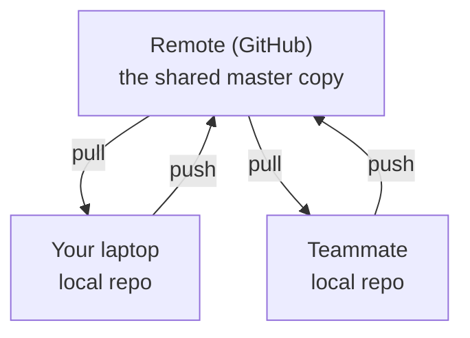
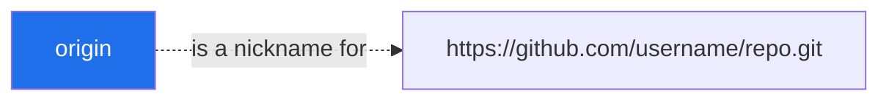
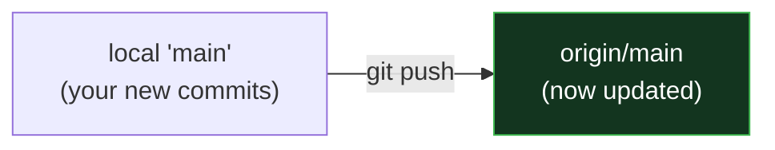
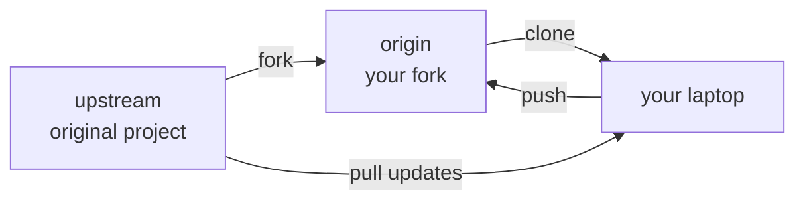

# Day 3 - Remote Repositories & GitHub Integration

> **Goal of today:** take your local Git work *online* - push to GitHub, pull others' work, and understand authentication (including the errors everyone hits).

---

## Objective of Day 3

By the end you will be able to:
- Explain what a remote repository is
- Connect a local repo to GitHub
- Push, pull, fetch, and clone
- Understand `origin` vs `upstream`
- Set up authentication (HTTPS token vs SSH) - and fix common errors

---

## 1. What is a Remote Repository?

### Analogy
Your **local repo** is the copy of a shared document on your laptop. A **remote repo** is the master copy stored on **Google Drive** that the whole team syncs with.

A **remote repository** is a Git repo hosted on a server/the internet. Popular hosts:
- **GitHub** (most popular) • **GitLab** • **Bitbucket**

It lets teams **share code, collaborate, and back up** their work online.



---

## 2. Local vs Remote

| | **Local Repo** | **Remote Repo** |
|---|---|---|
| Location | On your computer | On a server (GitHub) |
| Internet | Works offline | Needs network to sync |
| Purpose | Your personal work | Shared team work / backup |

---

## 3. Connecting a Local Repo to GitHub

**Step 1 - Create an empty repo on GitHub:** click **New repository**, give it a name, **don't** add a README (so it's empty).

**Step 2 - Link your local repo to it:**
```bash
git remote add origin https://github.com/username/repo.git
git remote -v          # verify the link
```
`git remote add` says: *"create a shortcut named `origin` pointing to this URL."*

---

## 4. What is `origin`?

`origin` is simply the **default nickname** for your main remote - a short alias so you don't type the full URL every time.



> You *can* rename it or have several remotes (e.g. `origin` and `upstream`), but `origin` is the convention for "my main remote."

---

## 5. Pushing Code to GitHub (`git push`)

**Push** = upload your local commits to the remote.

```bash
git push -u origin main
```
- `origin` → which remote
- `main` → which branch
- `-u` → remember this pairing ("set upstream") so next time you can just type:
```bash
git push
```



---

## 6. Pulling Code (`git pull`)

**Pull** = download teammates' changes and merge them into your branch.
```bash
git pull
```

---

## 7. Fetch vs Pull (an important distinction)

### Analogy
- **`git fetch`** = the postman drops mail in your **mailbox**. You can see it arrived, but it's not opened/used yet. Safe.
- **`git pull`** = the postman **opens the mail and merges it into your documents** immediately. Convenient, but can cause conflicts.

> **`pull` = `fetch` + `merge`**

| | **`git fetch`** | **`git pull`** |
|---|---|---|
| Downloads remote changes | | |
| Merges into your branch | (you decide later) | automatically |
| Safety | Very safe - nothing changes locally | Can trigger conflicts |

> **Pro habit:** when unsure, `git fetch` first, inspect with `git log origin/main`, *then* merge.

---

## 8. Cloning a Repository (`git clone`)

To get a **complete local copy** of an existing remote repo:
```bash
git clone https://github.com/username/repo.git
```
This downloads all files **and** the full history, and automatically sets up `origin` for you.

---

## 9. `origin` vs `upstream` (open-source contributions)

When you **fork** someone else's project (make your own copy on GitHub), you end up with two remotes:

| Remote | Points to | Role |
|---|---|---|
| **`origin`** | *Your* fork | Where you push your work |
| **`upstream`** | The *original* project | Where you pull the latest official changes |



Add upstream like this:
```bash
git remote add upstream https://github.com/original-owner/repo.git
git pull upstream main      # get the latest official changes
```

---

## 10. Authentication: HTTPS vs SSH

GitHub must verify *who you are* before letting you push. Two ways:

### Option A - HTTPS + Personal Access Token (PAT)
- Uses your username + a **token** (NOT your account password - GitHub stopped accepting passwords for Git in 2021).
- Create one: GitHub → **Settings → Developer settings → Personal access tokens** → enable the **`repo`** scope.
- On Windows, **Git Credential Manager** can pop a browser login instead - no manual token needed.

### Option B - SSH keys
- You generate a key pair; the public key lives on GitHub, the private key on your machine.
- No password needed on each push; great for daily use.
```bash
ssh-keygen -t ed25519 -C "your-email@example.com"   # generate
# then add ~/.ssh/id_ed25519.pub to GitHub → Settings → SSH and GPG keys
ssh -T git@github.com                                # test it
```

| | **HTTPS + Token** | **SSH** |
|---|---|---|
| Setup | Easiest (esp. with Credential Manager) | A few more steps |
| Daily use | May cache token | No password each time |
| Best for | Beginners, quick start | Frequent use, multiple repos |

### Real-world troubleshooting (you *will* see these)

| Error | What it usually means | Fix |
|---|---|---|
| `remote: Repository not found` | Repo is **private and you're not authenticated**, *or* the name is wrong, *or* you're logged in as the **wrong account** | Verify the URL; log in as the account that has access (`gh auth login`) |
| `Permission denied (publickey)` | No SSH key registered with GitHub | Generate a key and add it to GitHub |
| Pushes go to the wrong account | A different cached credential is being used | Clear it from your OS credential store, or put the username in the URL: `https://USERNAME@github.com/...` |

> GitHub deliberately returns **"not found"** for private repos you can't access - it won't reveal that a private repo exists. So "not found" often *really* means "not authorized."

---

## 11. Creating & Pushing Remote Branches

Push a local feature branch up to GitHub:
```bash
git push origin feature-branch
```
This creates the same branch on the remote so teammates can see/review it (e.g. for a Pull Request - covered Day 4).

---

## 12. Keeping Local in Sync with Remote

```bash
git pull origin main          # get the latest main before you start working
```
> **Golden habit:** `pull` before you start, `push` when you finish. It dramatically reduces conflicts.

---

## Common Beginner Mistakes
1. **Forgetting to `pull` before starting** → painful conflicts later.
2. **Using your GitHub password** instead of a token for HTTPS → auth fails.
3. **Confusing `origin` and `upstream`** when contributing to open source.
4. **Pushing secrets** (`.env`, keys) to a public repo. Use `.gitignore`!

---

## Quick Self-Check
1. What is a remote repository, in one sentence?
2. `git fetch` vs `git pull` - what's the difference?
3. What does the `-u` in `git push -u origin main` do?
4. When contributing to open source, what do `origin` and `upstream` point to?
5. Why might GitHub say "Repository not found" even when the repo exists?

---

## Hands-On Lab
```bash
# 1. Create an EMPTY repo on github.com first, then:
git init
echo "# My Project" > README.md
git add . && git commit -m "Initial commit"
git branch -M main
git remote add origin https://github.com/<you>/<repo>.git
git push -u origin main          # authenticate when prompted
# 2. Edit README.md on github.com (in the browser), then locally:
git pull                         # watch the change come down
```

---

## End of Day 3 Summary
You can now:
- Connect local Git to GitHub
- Push, pull, fetch, and clone
- Understand `origin` vs `upstream`
- Set up HTTPS/SSH auth and fix common errors

Next up → [**Day 4: Advanced Git & Collaboration**](../day4-advanced-git/notes.md)
