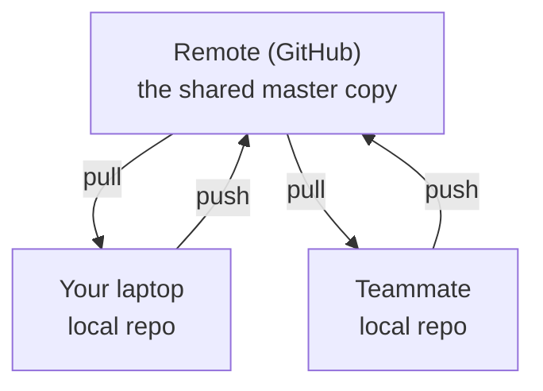
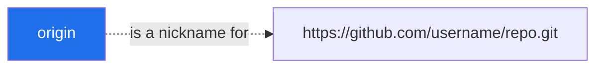
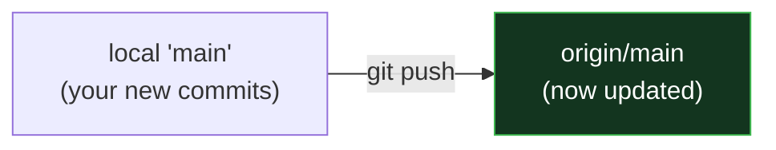
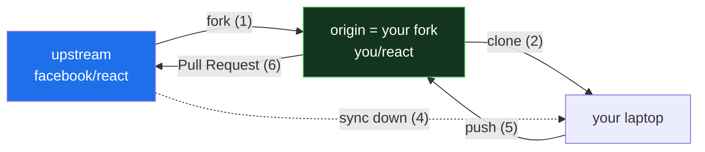
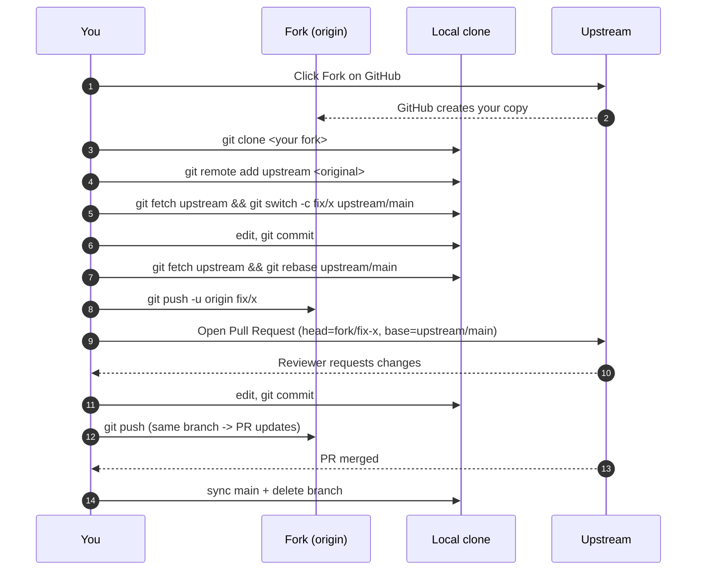

# Day 3 - Remote Repositories & GitHub Integration

> **Goal of today:** take your local Git work *online* - push to GitHub, pull others' work, and understand authentication (including the errors everyone hits).

---

## Objective of Day 3

By the end you will be able to:
- Explain what a remote repository is
- Connect a local repo to GitHub
- Push, pull, fetch, and clone
- Understand `origin` vs `upstream`
- Set up authentication (HTTPS token vs SSH) - and fix common errors

---

## 1. What is a Remote Repository?

### Analogy
Your **local repo** is the copy of a shared document on your laptop. A **remote repo** is the master copy stored on **Google Drive** that the whole team syncs with.

A **remote repository** is a Git repo hosted on a server/the internet. Popular hosts:
- **GitHub** (most popular) • **GitLab** • **Bitbucket**

It lets teams **share code, collaborate, and back up** their work online.



---

## 2. Local vs Remote

| | **Local Repo** | **Remote Repo** |
|---|---|---|
| Location | On your computer | On a server (GitHub) |
| Internet | Works offline | Needs network to sync |
| Purpose | Your personal work | Shared team work / backup |

---

## 3. Connecting a Local Repo to GitHub

**Step 1 - Create an empty repo on GitHub:** click **New repository**, give it a name, **don't** add a README (so it's empty).

**Step 2 - Link your local repo to it:**
```bash
git remote add origin https://github.com/username/repo.git
git remote -v          # verify the link
```
`git remote add` says: *"create a shortcut named `origin` pointing to this URL."*

---

## 4. What is `origin`?

`origin` is simply the **default nickname** for your main remote - a short alias so you don't type the full URL every time.



> You *can* rename it or have several remotes (e.g. `origin` and `upstream`), but `origin` is the convention for "my main remote."

---

## 5. Pushing Code to GitHub (`git push`)

**Push** = upload your local commits to the remote.

```bash
git push -u origin main
```
- `origin` → which remote
- `main` → which branch
- `-u` → remember this pairing ("set upstream") so next time you can just type:
```bash
git push
```



---

## 6. Pulling Code (`git pull`)

**Pull** = download teammates' changes and merge them into your branch.
```bash
git pull
```

---

## 7. Fetch vs Pull - the deep version

Both bring new work down from the remote. The difference is **what they do with it once it arrives**.

### Analogy
- **`git fetch`** = the postman drops mail in your **mailbox**. It's arrived; nothing is opened or filed. Your desk (working tree) is untouched. Safe.
- **`git pull`** = the postman drops the mail, **opens it, and files it into your folders** immediately. Convenient — but if you had a paper open on the same folder, you get a merge conflict.

### What is actually happening inside `.git`

For every branch on the remote, Git keeps a local **remote-tracking** copy under `refs/remotes/origin/`. Think of it as a cached snapshot of "what GitHub looked like the last time we synced."

```
        Your repo
   ┌────────────────────────────────────────┐
   │                                         │
   │  main             ← your local branch   │
   │                     (what you edit)     │
   │                                         │
   │  origin/main      ← cached mirror of    │
   │                     the remote          │
   │                     (read-only)         │
   │                                         │
   └────────────────────────────────────────┘
```

- **`git fetch`** updates *only* `origin/main` (and any other `origin/*`). Your local `main` does not move. You can inspect what arrived before deciding what to do with it.
- **`git pull`** does `git fetch` AND THEN merges (or rebases) `origin/main` into your local `main`. In one step.

> So: **`git pull` = `git fetch` + `git merge`** (by default).

### Concrete walk-through

You and a teammate both start from `main` pointing at commit `A`. The teammate pushes commit `B`.

```
   Before you sync                After teammate pushed (you don't know yet)

   A ← main, origin/main          A - B ← origin/main on GitHub
                                  │
                                  ↑ your local main and origin/main
                                    are both still pointing at A
```

You run `git fetch`:

```
   A - B ← origin/main        ← updated to match GitHub
   │
   ↑ main                     ← your local main is STILL at A
                                Your working files did not change.
```

Now you can look without committing to anything:

```bash
git log A..origin/main         # exactly what's new
git show origin/main           # see B's diff
git diff main origin/main      # what changes await you
```

If you decide to take it, **either** merge:

```bash
git merge origin/main          # fast-forward main to B
```

…**or** rebase your local commits on top:

```bash
git rebase origin/main
```

Alternatively, do everything in one command:

```bash
git pull                       # = fetch + merge (default)
git pull --rebase              # = fetch + rebase (linear history)
```

### Make `--rebase` your default (recommended)

Most teams prefer linear history, no surprise merge commits:

```bash
git config --global pull.rebase true
```

Now plain `git pull` rebases for you.

### When to reach for which

| Situation | Command |
|---|---|
| "Is there anything new on the remote?" | `git fetch` |
| "I'm starting work; get me the latest main" | `git pull` (clean tree) |
| "I have local commits; bring in remote changes and keep history linear" | `git pull --rebase` |
| "Someone may have force-pushed — I want to inspect first" | `git fetch`, then look |
| "Something's weird, I need just the remote refs without touching my branches" | `git fetch --all --prune` |

### Two safety habits

1. **Never `git pull` on a dirty working tree.** Commit, or `git stash`, first. A pull that triggers a conflict in your uncommitted edits is unpleasant.
2. **`git fetch --prune` periodically.** Removes local references to remote branches that have been deleted on GitHub — keeps `git branch -r` clean.

### `fetch` vs `pull` cheat sheet

| | **`git fetch`** | **`git pull`** |
|---|---|---|
| Updates `origin/*` cached refs | ✅ | ✅ |
| Touches your local branch | ❌ — your work is untouched | ✅ — merges or rebases into your branch |
| Touches your working tree | ❌ | ✅ — files on disk may change |
| Can trigger conflicts | ❌ | ✅ |
| Safety | Always safe | Safe IF your tree is clean |
| Use when | Inspecting, scripting, or unsure | Daily "get the latest" workflow |

---

## 8. Cloning a Repository (`git clone`)

To get a **complete local copy** of an existing remote repo:
```bash
git clone https://github.com/username/repo.git
```
This downloads all files **and** the full history, and automatically sets up `origin` for you.

---

## 9. Contributing to an Open Source Project - step by step

You don't have write access to most repos on the internet. So you can't just `git push` to them. The standard pattern is **fork → clone your fork → branch → push → Pull Request**.

### The cast of characters

| Name | What it is |
|---|---|
| **upstream** | The original project, e.g. `https://github.com/facebook/react.git` |
| **your fork (origin)** | Your personal copy of upstream on GitHub, e.g. `https://github.com/you/react.git` |
| **local clone** | The working copy on your laptop |



### Step 0 - Pick a project and read CONTRIBUTING.md
Every reasonable open-source project has a `CONTRIBUTING.md` (and often `CODE_OF_CONDUCT.md`). Read both. They tell you:
- Branch naming convention (`feature/xxx`, `fix/issue-123`)
- Commit message style (Conventional Commits, sign-off line / DCO)
- Whether to open an issue before submitting a PR
- Code style and required tests

Skipping this is the #1 reason maintainers close PRs without review.

### Step 1 - Fork the repo on GitHub
On the project's GitHub page click the **Fork** button (top right). GitHub creates `https://github.com/<you>/<repo>` — a full copy you own and can push to.

### Step 2 - Clone YOUR fork (not upstream)
```bash
git clone https://github.com/<you>/<repo>.git
cd <repo>
```
After clone, your only remote is `origin` — and it points at *your fork*, not the original. Verify:
```bash
git remote -v
# origin  https://github.com/<you>/<repo>.git (fetch)
# origin  https://github.com/<you>/<repo>.git (push)
```

### Step 3 - Add `upstream` so you can pull in the project's latest changes
```bash
git remote add upstream https://github.com/<original-owner>/<repo>.git
git remote -v
# origin    https://github.com/<you>/<repo>.git              (fetch/push)
# upstream  https://github.com/<original-owner>/<repo>.git   (fetch/push)
```
You will **fetch from `upstream`** but **push to `origin`**. (You can even block accidental pushes to upstream — see the advanced tip at the end.)

### Step 4 - Create a feature branch off the latest upstream
Always branch off a fresh `main`. Don't work directly on `main`.
```bash
git fetch upstream
git switch -c fix/typo-in-readme upstream/main
```
Use the branch-naming convention from `CONTRIBUTING.md`: `fix/...`, `feat/...`, `docs/...`.

### Step 5 - Make your changes and commit
```bash
# edit files
git add README.md
git commit -m "docs: fix typo in installation section"
```
Match the project's commit style. Many projects use **Conventional Commits** (`type(scope): message`).

If the project uses **DCO sign-off**, add `-s`:
```bash
git commit -s -m "docs: fix typo"
```

### Step 6 - Keep your branch in sync with upstream
If maintainers merged other PRs while you were working, pick up their changes before pushing:
```bash
git fetch upstream
git rebase upstream/main
# if conflicts:  fix them -> git add <file> -> git rebase --continue
```
Rebasing (not merging) keeps your PR clean — a straight chain of *your* commits on top of latest `main`. Reviewers love this.

### Step 7 - Push your branch to your fork
```bash
git push -u origin fix/typo-in-readme
```
GitHub responds with a URL:
> *Create a pull request for 'fix/typo-in-readme' on GitHub by visiting https://github.com/...*

### Step 8 - Open the Pull Request
Click that URL (or go to your fork → **Compare & pull request**). Two repositories appear:

- **base repository** — the **original** project, branch `main` (where your change will go)
- **head repository** — **your fork**, branch `fix/typo-in-readme` (where it comes from)

Fill in:
- **Title** — clear, often matching your commit message
- **Description** — *what* the change does and *why*; link related issues with `Closes #1234`
- Check off the project's PR checklist (tests, lint, changelog, signed-off)

Submit. CI starts running.

### Step 9 - Respond to review feedback
A maintainer comments: *"Could you also update the FAQ?"*

You make the change locally — **on the same branch** — and push again:
```bash
git add docs/FAQ.md
git commit -m "docs: also fix the FAQ section"
git push origin fix/typo-in-readme    # same branch -> the PR auto-updates
```
**Don't open a new PR.** Pushing to the same branch updates the existing PR.

If they ask you to rebase or squash:
```bash
git fetch upstream
git rebase -i upstream/main           # reorder, squash, edit messages
git push --force-with-lease origin fix/typo-in-readme
```
Always `--force-with-lease`, not `--force`. The lease version refuses if someone else pushed to the branch in the meantime — saving you from overwriting their work.

### Step 10 - After it's merged: clean up
The maintainer clicks "Merge". Now sync everything:
```bash
git switch main
git fetch upstream
git merge --ff-only upstream/main             # fast-forward your local main
git push origin main                          # update your fork's main
git branch -d fix/typo-in-readme              # delete the branch locally
git push origin --delete fix/typo-in-readme   # delete it on your fork
```
Your fork is clean. You're ready for the next contribution.

### Full visual recap



### Advanced tip - block accidental pushes to upstream
A typo (`git push upstream`) could try to push to the original project (and fail with `Permission denied`, but it's still noisy). Disable it once:
```bash
git remote set-url --push upstream DISABLE
```
Any future `git push upstream ...` fails loudly with `fatal: 'DISABLE' does not appear to be a git repository`.

### Common gotchas

| Mistake | What goes wrong | Fix |
|---|---|---|
| Working directly on `main` of your fork | Hard to keep main in sync; future PRs get messy | Always `git switch -c <branch> upstream/main` |
| Forgetting to rebase before opening the PR | Reviewers see conflicts; CI fails on stale base | `git fetch upstream && git rebase upstream/main` before pushing |
| Letting your fork's `main` drift behind upstream | New branches start from old code | After every merge, sync your fork's main (Step 10) |
| Opening a new PR instead of pushing more commits to the same branch | Reviewers lose all context and comments | Push to the same branch — the PR updates in place |
| Using `git push --force` | Can silently overwrite a teammate's just-pushed commit | Always `git push --force-with-lease` |
| Cloning upstream instead of your fork | You can't push your changes anywhere | Always clone *your fork* — that's the one you have write access to |

---

## 10. Authentication: HTTPS vs SSH

GitHub must verify *who you are* before letting you push. Two ways:

### Option A - HTTPS + Personal Access Token (PAT)
- Uses your username + a **token** (NOT your account password - GitHub stopped accepting passwords for Git in 2021).
- Create one: GitHub → **Settings → Developer settings → Personal access tokens** → enable the **`repo`** scope.
- On Windows, **Git Credential Manager** can pop a browser login instead - no manual token needed.

### Option B - SSH keys
- You generate a key pair; the public key lives on GitHub, the private key on your machine.
- No password needed on each push; great for daily use.
```bash
ssh-keygen -t ed25519 -C "your-email@example.com"   # generate
# then add ~/.ssh/id_ed25519.pub to GitHub → Settings → SSH and GPG keys
ssh -T git@github.com                                # test it
```

| | **HTTPS + Token** | **SSH** |
|---|---|---|
| Setup | Easiest (esp. with Credential Manager) | A few more steps |
| Daily use | May cache token | No password each time |
| Best for | Beginners, quick start | Frequent use, multiple repos |

### Real-world troubleshooting (you *will* see these)

| Error | What it usually means | Fix |
|---|---|---|
| `remote: Repository not found` | Repo is **private and you're not authenticated**, *or* the name is wrong, *or* you're logged in as the **wrong account** | Verify the URL; log in as the account that has access (`gh auth login`) |
| `Permission denied (publickey)` | No SSH key registered with GitHub | Generate a key and add it to GitHub |
| Pushes go to the wrong account | A different cached credential is being used | Clear it from your OS credential store, or put the username in the URL: `https://USERNAME@github.com/...` |

> GitHub deliberately returns **"not found"** for private repos you can't access - it won't reveal that a private repo exists. So "not found" often *really* means "not authorized."

---

## 11. Creating & Pushing Remote Branches

Push a local feature branch up to GitHub:
```bash
git push origin feature-branch
```
This creates the same branch on the remote so teammates can see/review it (e.g. for a Pull Request - covered Day 4).

---

## 12. Keeping Local in Sync with Remote

```bash
git pull origin main          # get the latest main before you start working
```
> **Golden habit:** `pull` before you start, `push` when you finish. It dramatically reduces conflicts.

---

## Common Beginner Mistakes
1. **Forgetting to `pull` before starting** → painful conflicts later.
2. **Using your GitHub password** instead of a token for HTTPS → auth fails.
3. **Confusing `origin` and `upstream`** when contributing to open source.
4. **Pushing secrets** (`.env`, keys) to a public repo. Use `.gitignore`!

---

## Quick Self-Check
1. What is a remote repository, in one sentence?
2. `git fetch` vs `git pull` - what's the difference?
3. What does the `-u` in `git push -u origin main` do?
4. When contributing to open source, what do `origin` and `upstream` point to?
5. Why might GitHub say "Repository not found" even when the repo exists?

---

## Hands-On Lab
```bash
# 1. Create an EMPTY repo on github.com first, then:
git init
echo "# My Project" > README.md
git add . && git commit -m "Initial commit"
git branch -M main
git remote add origin https://github.com/<you>/<repo>.git
git push -u origin main          # authenticate when prompted
# 2. Edit README.md on github.com (in the browser), then locally:
git pull                         # watch the change come down
```

---

## End of Day 3 Summary
You can now:
- Connect local Git to GitHub
- Push, pull, fetch, and clone
- Understand `origin` vs `upstream`
- Set up HTTPS/SSH auth and fix common errors

Next up → [**Day 4: Advanced Git & Collaboration**](../day4-advanced-git/notes.md)
