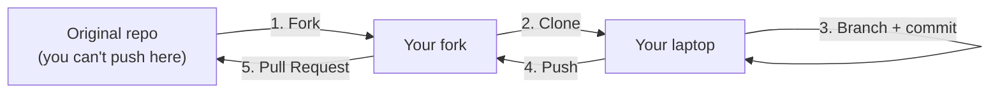
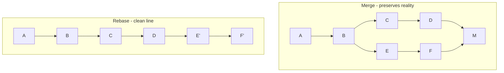

# Day 4 - Collaboration Workflow & Essential Git Commands

> **Goal of today:** the professional toolkit - Pull Requests, code review, and the "power commands" (stash, cherry-pick, rebase) you'll use on real teams.

> **Open while you read:** [Branching: Merge vs Rebase](../animations/git-branching.html) - section 5 makes total sense once you've played with it.

---

## Objective of Day 4

By the end you will be able to:
- Open and review **Pull Requests**
- Contribute via **forks**
- Keep a feature branch up to date (**merge vs rebase**)
- Use **stash**, **revert**, **cherry-pick**
- Resolve merge conflicts
- **Squash** commits and **force-push safely**
- Use **interactive rebase** to clean history

---

## 1. Pull Requests (PRs)

### Analogy
A Pull Request is like submitting an essay for a teacher's review **before** it goes in the school magazine. You say "here's my work - please check it," others comment, you revise, and only then is it published (merged).

A **Pull Request** is a request to merge code from one branch into another (usually into `main`), with a built-in space for **review and discussion** *before* the merge.


**Why PRs matter:** they ensure code quality, enable team review, **prevent direct commits to `main`**, and create a permanent record of *why* a change was made.

**PR best practices:**
- Keep PRs **small** (easier to review well)
- Write a **clear description** of what & why
- Add **screenshots** for UI changes
- Request **specific reviewers**
- **Respond** to every comment

---

## 2. Code Review

Code review = another developer reads your change before it merges. It's not criticism - it's a safety net and a teaching moment.

**Benefits:** catches bugs early • improves quality • spreads knowledge across the team • keeps a consistent style.

> **Reviewer mindset:** be kind, be specific, ask questions ("what happens if this is empty?") rather than issuing orders.

---

## 3. Fork-Based Contribution (open source)

### What is a fork?
A **fork** is your *own copy* of someone else's repository on GitHub. You can't push directly to projects you don't own - so you fork, change *your* copy, and propose your change back via a PR.



**Fork workflow:** `Fork → Clone → Branch → Commit → Push → Pull Request`

> See [Day 3](../day3-remote-github/notes.md) for `origin` (your fork) vs `upstream` (the original) remotes.

---

## 4. Keeping Your Feature Branch Up to Date

While you work, `main` keeps moving as teammates merge. If your branch falls behind, update it **before** merging to avoid a messy integration.

```
main:    A --- B --- C --- D        (C, D added by others)
              \
feature:       E --- F              (your work, now behind)
```

You have **two ways** to catch up: **merge** or **rebase**.

### Option 1 - Merge `main` into your feature
```bash
git switch feature
git merge main
```
```
main:    A --- B --- C --- D
              \           \
feature:       E --- F --- M     (M = merge commit)
```
Safe • preserves history • commit IDs unchanged
Adds extra merge commits → noisier history

### Option 2 - Rebase your feature onto `main`
```bash
git switch feature
git rebase main
```
```
main:    A --- B --- C --- D
                          \
feature:                   E' --- F'   (replayed on top)
```
Clean, linear history • no merge commit
**Rewrites history** (E→E′, F→F′) - only safe on *your own* unshared branch

---

## 5. Merge vs Rebase (the big one)

### Analogy
- **Merge** = stapling two notebooks together with a note saying "combined here." The real timeline is preserved.
- **Rebase** = neatly recopying your draft pages *onto the end* of the main book so it reads as one straight story.

| | **Merge** | **Rebase** |
|---|---|---|
| History shape | Branched (fork & join) | Straight & linear |
| Merge commit? | Yes | No |
| Rewrites history? | No | **Yes** (new commit IDs) |
| Safe on shared branches? | Yes | No |



### The Golden Rule of Rebase
> **Never rebase commits that have already been pushed and shared with others.**
> Rebasing shared history rewrites commits other people already have → chaos. Use rebase only to tidy *your own local* branch before opening a PR.

| Situation | Use |
|---|---|
| Working alone, tidy before PR | **Rebase** |
| Shared/public branch | **Merge** |
| Open-source contribution | **Rebase** (clean history is appreciated) |
| Integrating into `main` | **Merge** (via PR) |

> Still fuzzy? The [interactive Merge vs Rebase animation](../animations/git-branching.html) lets you *watch* both happen.

---

## 6. Git Stash - shelve work temporarily

### Analogy
You're mid-cooking and need the counter *right now* for something urgent. Sweep your work onto a tray, deal with the emergency, then bring the tray back.

```bash
git stash          # shelve all uncommitted changes; working dir goes clean
git switch main    # handle the urgent thing
git switch feature
git stash pop      # bring your work back exactly as it was
```
More in the [Power Tools lesson](../day6-power-tools/notes.md).

---

## 7. Git Revert - safely undo a commit

**Revert** creates a *new* commit that reverses a previous one - without destroying history. This makes it **safe for shared branches**.
```bash
git revert <commit-id>
```
> This is so important it has its own deep-dive: [**revert.md**](revert.md) - including reverting merge commits and revert-vs-reset.

---

## 8. Git Cherry-Pick - grab one specific commit

### Analogy
Picking *one* cherry off a tree instead of taking the whole branch. You copy a single commit from one branch onto your current branch.
```bash
git cherry-pick <commit-id>
```
**Use case:** a bug fix was committed on `develop`, but you need *just that one fix* on your release branch right now.

---

## 9. Handling Merge Conflicts

Conflicts happen when the **same lines** of the **same file** were changed differently on two branches. Git can't guess which is right, so it asks you.

```
<<<<<<< HEAD
Your changes (current branch)
=======
Incoming changes (other branch)
>>>>>>> branch-name
```
**Resolve in 4 steps:**
1. Open the conflicted file
2. Edit it to the correct final version
3. Delete the `<<<<<<<`, `=======`, `>>>>>>>` markers
4. Stage & commit:
```bash
git add .
git commit
```
> Conflicts are **normal**, not a sign you broke something. Different files / different lines merge automatically - only true overlaps conflict.

---

## 10. Squashing Commits - a clean history

### Analogy
You made 8 messy commits while figuring something out (`wip`, `fix typo`, `oops`, `try again`). **Squashing** combines them into **one clean commit** before merging - so the project history reads nicely.

The easiest way is the **"Squash and merge"** button on a GitHub PR. Manually, use interactive rebase (next section).

---

## 11. Interactive Rebase - rewrite your own history

### What it does
`git rebase -i` lets you **edit, reorder, squash, or delete** your recent commits - like editing a rough draft before publishing. **Only do this on commits you haven't shared yet.**
```bash
git rebase -i HEAD~3        # edit the last 3 commits
```
Git opens an editor listing them:
```
pick a1b2c3 Add login form
pick d4e5f6 fix typo
pick g7h8i9 oops forgot import
```
Change the words to act:
```
pick   a1b2c3 Add login form
squash d4e5f6 fix typo          # fold into the commit above
squash g7h8i9 oops forgot import
```
Save → Git combines them into one tidy commit. Common actions: `pick` (keep), `squash` (merge into previous), `reword` (change message), `drop` (delete).

> [!WARNING]
> Interactive rebase **rewrites history**. Golden Rule still applies: never on commits you've already pushed/shared.

---

## 12. Safe Force-Push (`--force-with-lease`)

After a rebase, your local branch's history differs from the remote, so a normal `push` is rejected ("non-fast-forward"). You must force it - but **safely**:
```bash
git push --force-with-lease
```
- `git push --force` → overwrites the remote *blindly* (can erase a teammate's commits).
- `git push --force-with-lease` → only forces if **no one else has pushed** since you last fetched. It refuses if it would clobber someone's work.

> **Rule:** if you ever feel you need `--force`, use `--force-with-lease` instead. And never force-push a shared branch like `main`.

---

## Common Mistakes
1. **Rebasing a shared branch** → breaks teammates' history (Golden Rule!).
2. **Giant PRs** that no one can review properly.
3. **`git push --force`** instead of `--force-with-lease`.
4. **Leaving conflict markers** (`<<<<<<<`) in files - always search for them before committing.

---

## Quick Self-Check
1. What problem does a Pull Request solve?
2. Merge vs rebase: which keeps a linear history? Which is safe on shared branches?
3. State the Golden Rule of Rebase.
4. What's the difference between `revert` and `reset`?
5. Why prefer `--force-with-lease` over `--force`?
6. What does `git rebase -i` let you do?

---

## Hands-On Lab
```bash
# 1. cherry-pick practice
git switch -c fix-branch
echo "important fix" > fix.txt && git add . && git commit -m "Critical fix"
git log --oneline                  # copy the fix commit hash
git switch main
git cherry-pick <that-hash>        # bring just that commit over

# 2. interactive rebase: squash 3 messy commits into one
git switch -c messy
echo a> a.txt && git add . && git commit -m "wip"
echo b>> a.txt && git add . && git commit -m "fix"
echo c>> a.txt && git add . && git commit -m "oops"
git rebase -i HEAD~3               # squash the last two into the first
```

---

## End of Day 4 Summary
You can now:
- Open, review, and merge Pull Requests
- Contribute via forks
- Update branches with merge or rebase (and know the Golden Rule)
- Use stash, revert, cherry-pick
- Resolve conflicts, squash commits, and force-push safely

Next up → [**Day 5: Branching Strategies & Best Practices**](../day5-branching-strategies/notes.md)
Deeper on undo → [**revert.md**](revert.md)
