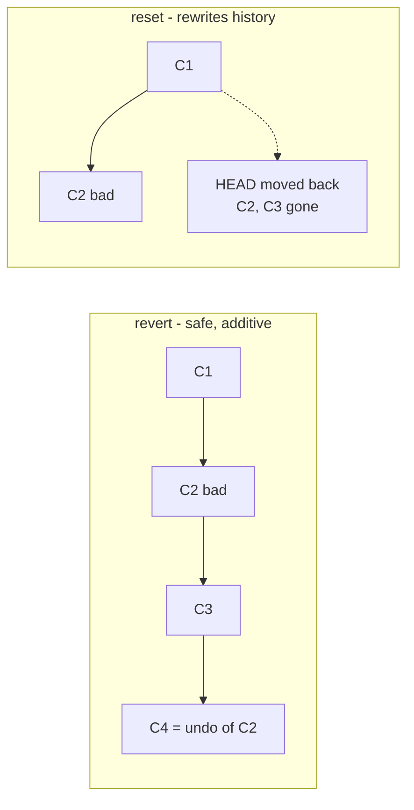

# Git Revert - Complete Guide

> A focused deep-dive from [Day 4](readme.md). `git revert` is the **safe undo button** you'll reach for on shared/production branches.

---

## What is `git revert`?

`git revert` creates a **new commit** that undoes the changes of a previous commit - **without deleting any history**.

### Analogy
Reverting is like publishing a **correction notice** in a newspaper. You don't tear the old (wrong) article out of every printed copy - that's impossible once it's out there. Instead you print a *new* notice saying "the previous article was incorrect; here's the correction." The record stays honest, and everyone sees what happened.

> **Plain English:** *"Undo this change, but keep a record that we undid it."*

---

## Revert vs Reset (the key mental model)

Both "undo," but very differently:

| | `git revert` | `git reset` |
|---|---|---|
| What it does | Adds a **new** commit that cancels an old one | **Moves the branch pointer** backward |
| History | Preserved (honest audit trail) | Rewritten (commits disappear) |
| Safe on shared branches? | **Yes** | No (needs force-push) |
| Best for | Production / pushed commits | Local, not-yet-shared cleanup |



> **Rule of thumb:** if the commit has been **pushed/shared**, use **revert**. If it's **local and private**, `reset` is fine.

---

## Why Use Revert?
- Undo a bad commit **safely**
- Keep the **full history** (great for audits & debugging)
- Works on **shared/public branches** without breaking teammates
- **No force-push** required

---

## Basic Usage

### Revert a single commit
```bash
git revert <commit-hash>
```
Git will:
1. Create a new commit that undoes the target commit
2. Open an editor for the commit message (just save to accept)
3. Complete the revert

### Example
```bash
git log --oneline
# a1b2c3d Add feature X     <-- we want to undo this
# e4f5g6h Fix bug Y
# i7j8k9l Initial commit

git revert a1b2c3d
```
This undoes "Add feature X" by adding a new commit, while keeping the original in history.

---

## Reverting Multiple Commits
```bash
git revert HEAD~2..HEAD     # revert the last 2 commits
git revert --no-commit HEAD~2..HEAD   # stage all reversals into ONE commit
git commit -m "Roll back last 2 changes"
```
`--no-commit` is handy when you want a single, clean rollback commit instead of one per reverted change.

---

## Reverting a Merge Commit (the tricky case)

A merge commit has **two parents**, so Git needs to know which parent line to keep with the `-m` flag:
```bash
git revert -m 1 <merge-commit-hash>
```
- `-m 1` → keep **parent #1** (usually `main` - the branch you merged *into*).
- `-m 2` → keep parent #2 (the branch that was merged in).

> 99% of the time when reverting a feature merge on `main`, you want `-m 1`.

---

## Real-World: Production Rollback

A bad deploy just went out. Calm, safe response:
```bash
git log --oneline                # find the bad commit/merge hash
git revert <bad-hash>            # or: git revert -m 1 <merge-hash>
git push                         # redeploy - the bad change is undone, history intact
```
No force-push, no lost history, full audit trail of what broke and when it was fixed. This is exactly why teams prefer `revert` over `reset` on `main`.

---

## Common Mistakes
1. **Using `reset` on a shared branch** to "undo," then being unable to push without force.
2. **Forgetting `-m 1`** when reverting a merge commit (Git errors out asking for it).
3. Expecting revert to **erase** the bad commit - it doesn't; it *cancels* it with a new commit (that's the point).

---

## Quick Self-Check
1. Does `git revert` delete the bad commit? What does it do instead?
2. Why is `revert` safe on shared branches but `reset` isn't?
3. What does the `-m 1` flag mean when reverting a merge?
4. Production is broken after a deploy - what's your safe one-command fix?
5. When is `reset` actually the better choice?

---

## Summary
`git revert` is your **safe undo button**: it cancels a change by adding a new commit, never rewrites history, and is the correct tool for anything already shared or in production.

Back to → [Day 4](readme.md) • Recovery tools → [Power Tools: reflog, bisect](../day6-power-tools/readme.md)
