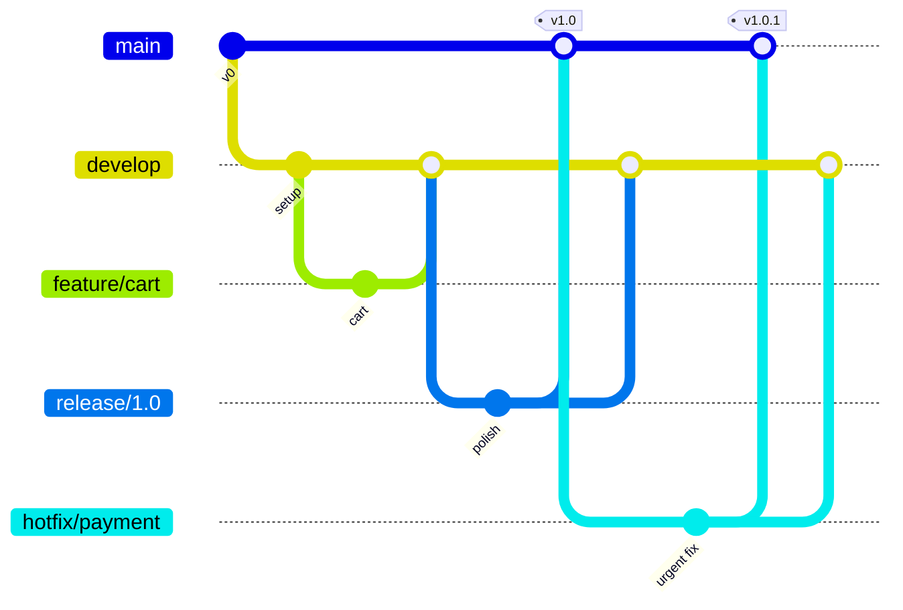
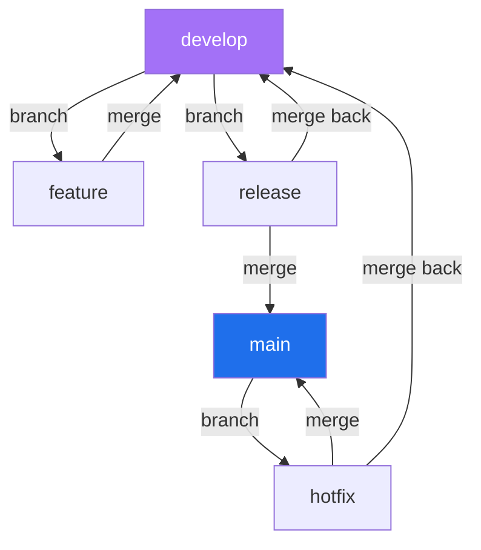

# GitFlow Branching Strategy - Deep Dive

> A companion to [Day 5](notes.md). Here we break down **GitFlow** branch by branch, so you understand exactly how code flows from idea to production.

---

## The big idea

GitFlow organizes work into **two permanent branches** and **three kinds of temporary branches**. Think of it like a factory with dedicated lines for each job.



---

## Permanent branches (live forever)

| Branch | Contains | Rule |
|---|---|---|
| **`main`** (a.k.a. `master`) | Production-ready, released code **only** | Every commit here is a real release; tag it |
| **`develop`** | The latest integrated, in-progress code | Features merge here first, before release |

> **Naming note:** `main` was historically called `master`. They are the same branch - just a renamed default (the community standardized on `main` in 2020). If you see `master` in an old repo, treat it as `main`.

---

## Temporary branches (created, then deleted)

### Feature branches
- **Branch from:** `develop`
- **Merge back to:** `develop`
- **Purpose:** build one new feature in isolation.
```bash
git switch -c feature/login develop
# ...build the feature...
git switch develop && git merge feature/login
git branch -d feature/login
```

### Release branches
- **Branch from:** `develop`
- **Merge back to:** `main` **and** `develop`
- **Purpose:** stabilize a version - only bug fixes, docs, and final polish (no new features).
```bash
git switch -c release/1.0 develop
# ...final testing & fixes...
git switch main && git merge release/1.0
git tag -a v1.0 -m "Release 1.0"
git switch develop && git merge release/1.0    # keep develop up to date
```

### Hotfix branches
- **Branch from:** `main`
- **Merge back to:** `main` **and** `develop`
- **Purpose:** fix a critical production bug *immediately*, without waiting for the next release.
```bash
git switch -c hotfix/payment main
# ...fix the urgent bug...
git switch main && git merge hotfix/payment
git tag -a v1.0.1 -m "Hotfix: payment bug"
git switch develop && git merge hotfix/payment  # don't forget this!
```

---

## The golden rules (memorize these)

1. **`main` only ever holds released code.** Tag every commit on it.
2. **Features always start from `develop`**, never from `main`.
3. **Hotfixes always start from `main`** (that's what production is running).
4. **Release & hotfix branches merge into BOTH `main` and `develop`** - otherwise fixes get lost in the next release.



---

## When NOT to use GitFlow

GitFlow shines for products with **scheduled, versioned releases** (mobile apps, desktop software, enterprise products). For a web app you deploy many times a day, it's usually **too heavy** - prefer **GitHub Flow** (one `main` + short feature branches) covered in [Day 5](notes.md).

---

## Quick Self-Check
1. Name the two permanent branches and what each holds.
2. A feature branch starts from which branch? A hotfix branch?
3. Why must release and hotfix branches merge into **two** branches?
4. Where do you put final pre-release bug fixes?
5. When is GitFlow the *wrong* choice?

---

Back to → [Day 5](notes.md) • Don't miss → [Git Power Tools](../day6-power-tools/notes.md)
