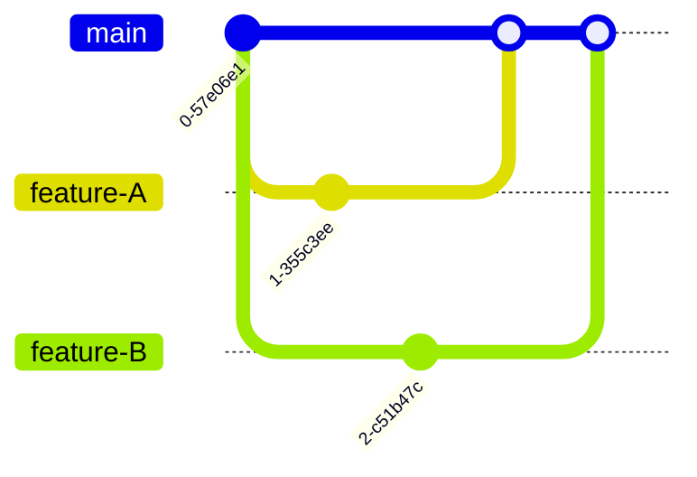
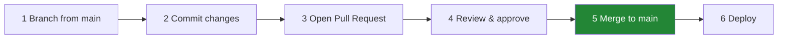
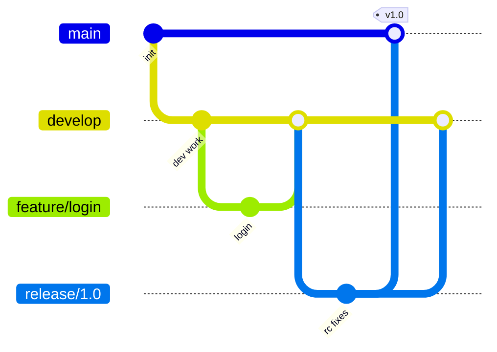
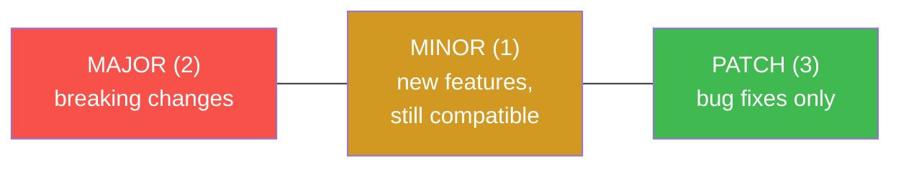
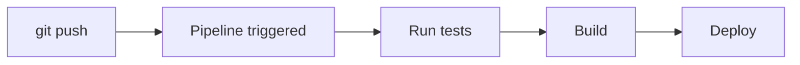

# Day 5 - Advanced Git, Branching Strategies & Industry Best Practices

> **Goal of today:** learn how *real companies* organize their Git work - the workflows, releases, and habits that keep large teams shipping safely.

---

## Objective of Day 5

By the end you will be able to:
- Compare **GitHub Flow** and **GitFlow** and pick the right one
- Manage **releases** and **hotfixes**
- Use **tags** and **semantic versioning**
- Understand how Git triggers **CI/CD**
- Apply professional **repository hygiene**

---

## 1. Team-Based Feature Branch Workflow

In real teams, many developers work at once. The shared rule: **nobody commits directly to `main`.** Everyone branches, then merges back through a reviewed **Pull Request**.



A **branching strategy** is just the agreed set of rules for *which* branches exist and *how* code flows between them. The two most common are below.

---

## 2. GitHub Flow (simple & modern)

### Analogy
A **single main road** with short side-trips. You leave `main`, do one thing, and come straight back.



**There's only ONE long-lived branch: `main`** (always deployable). Everything else is a short-lived feature branch.

**Best for:** small/medium teams, web apps, **continuous deployment** (ship many times a day).

---

## 3. GitFlow (structured, for scheduled releases)

### Analogy
A **factory with separate assembly lines**: one line for daily integration, one for packaging a release, one for emergency repairs.

GitFlow uses **two permanent branches** plus three temporary types:

| Branch | Lives | Purpose |
|---|---|---|
| **`main`** | forever | Production-ready, released code only |
| **`develop`** | forever | Integration branch - features land here first |
| **`feature/*`** | temporary | Build a new feature (branch off `develop`) |
| **`release/*`** | temporary | Stabilize & prepare a version before going live |
| **`hotfix/*`** | temporary | Urgent production fix (branch off `main`) |



**Best for:** larger teams, mobile/desktop apps, products with **planned, versioned releases**.

> **Deeper dive:** see [`branching-strategy.md`](branching-strategy.md) for the full GitFlow branch-by-branch breakdown.

### Which should *you* use?
| Use **GitHub Flow** if… | Use **GitFlow** if… |
|---|---|
| You deploy continuously | You ship on a schedule (v1.0, v1.1…) |
| Small/medium team | Large team, multiple versions in support |
| Simplicity matters | You need strict release control |

> Most modern web teams use **GitHub Flow** (or a trunk-based variant). GitFlow is heavier - powerful, but often more process than small teams need.

---

## 4. Release & Hotfix Management

### Release branch - prepare a version calmly
```bash
git switch -c release-1.0 develop
# only bug fixes & final polish here - no new features
# when ready, merge to main AND back to develop, then tag
```

### Hotfix branch - fix production *now*
```bash
git switch -c hotfix-login main      # branch straight off production
# fix the bug, commit
git switch main && git merge hotfix-login
git switch develop && git merge hotfix-login   # don't forget this!
```

> **Always merge a hotfix back into `develop` too**, or the bug reappears in your next release.

---

## 5. Tagging & Versioning

A **tag** is a permanent label on a specific commit - usually marking a release.
```bash
git tag v1.0                 # lightweight tag
git tag -a v1.0 -m "First release"   # annotated tag (recommended - stores author/date/message)
git push origin v1.0         # tags aren't pushed by default
git push origin --tags       # push all tags
```

### Lightweight vs annotated
- **Lightweight** = a sticky note (just a name).
- **Annotated** = a sticky note *with* who/when/why - preferred for releases.

---

## 6. Semantic Versioning (SemVer)

A shared language for version numbers: **`MAJOR.MINOR.PATCH`** → e.g. `2.1.3`



- Bump **MAJOR** when you break backward compatibility (`1.x → 2.0`).
- Bump **MINOR** when you add features that don't break anything (`2.0 → 2.1`).
- Bump **PATCH** for backward-compatible bug fixes (`2.1 → 2.1.1`).

---

## 7. Git in CI/CD

### Analogy
A **motion-sensor light**: you walk in (push code), the light turns on automatically (the pipeline runs). No one flips a switch.

When you push (or open a PR), Git **triggers an automated pipeline** that can:
1. Run tests
2. Build the app / container image
3. Deploy to an environment



> This is exactly the bridge into the **CI/CD module** later in the course.

---

## 8. Repository Hygiene (habits of good teams)

- **Use `.gitignore`** - never commit secrets, `node_modules`, build output.
- **Delete merged branches** - keep the branch list short.
- **Write clear commit messages** - your history is documentation.
- **Review before merge** - every change goes through a PR.
- **Protect `main`** - require reviews & passing tests before merging (GitHub branch protection rules).

---

## Common Mistakes
1. **Choosing GitFlow for a tiny team** → drowning in process. Start simple.
2. **Forgetting to merge a hotfix back into `develop`.**
3. **Pushing tags and forgetting** they need `git push origin --tags`.
4. **Letting `main` accept un-reviewed commits.**

---

## Quick Self-Check
1. How many long-lived branches does GitHub Flow have? GitFlow?
2. When would you choose GitFlow over GitHub Flow?
3. A hotfix is merged into `main` - what other branch must it also go into?
4. In `2.1.3`, which number bumps for a breaking change?
5. What triggers a CI/CD pipeline?

---

## Hands-On Lab
```bash
# practice a release tag
git switch main
git tag -a v1.0 -m "First stable release"
git push origin v1.0

# practice GitHub Flow end-to-end
git switch -c feature-about
echo "About page" > about.txt
git add . && git commit -m "Add about page"
git push origin feature-about
# → open a Pull Request on github.com, review, merge, then:
git switch main && git pull
git branch -d feature-about
```

---

## End of Day 5 Summary
You can now:
- Apply GitHub Flow and GitFlow
- Manage releases, hotfixes, tags, and versions
- Understand Git's role in CI/CD
- Keep repositories clean and protected

**You've finished the core 5 days!** Don't miss the → [**Bonus: Git Power Tools**](../day6-power-tools/readme.md) (reflog, bisect, hooks).
Then continue to → [`learn-docker`](../../learn-docker).
