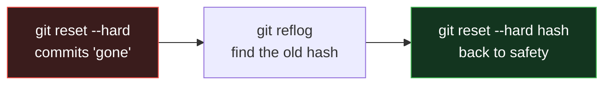

# Bonus Day: Git Power Tools - Save Yourself in a Crisis

> These are the commands that separate a nervous beginner from a calm professional. You won't use them every day - but the day you *need* them, they'll feel like magic. Every one is explained for a total beginner.

---

## What you'll learn
- `git reflog` - recover work you thought was gone forever
- `git bisect` - find the exact commit that introduced a bug
- `git hooks` - run checks automatically before each commit
- `git stash` - shelve work-in-progress without committing
- `git add -p` - stage *part* of a file
- Handy aliases & config to work faster

---

## 1 `git reflog` - The Undo Button for Your Undo Button

### Analogy
Imagine your computer's **Recycle Bin**, but for Git actions. Even when you do something scary - delete a branch, reset hard, mess up a rebase - Git quietly keeps a private log of *everywhere `HEAD` has been*. `reflog` shows you that log so you can travel back.

### The problem it solves
You ran `git reset --hard` and your last 2 commits vanished. Panic! But they're not really gone yet.

```bash
git reflog
```
Output looks like:
```
a1b2c3d HEAD@{0}: reset: moving to HEAD~2
9f8e7d6 HEAD@{1}: commit: add payment feature   <-- the work I "lost"!
1122334 HEAD@{2}: commit: add login page
```

Recover the lost commit:
```bash
git reset --hard 9f8e7d6     # jump back to that exact state
# or, more safely, create a branch from it:
git branch recovered 9f8e7d6
```

> [!IMPORTANT]
> `reflog` is **local only** and entries expire (default ~90 days). It's a safety net, not a backup. But 9 times out of 10, "I lost my commits!" is solved here.



---

## 2 `git bisect` - Find the Commit That Broke Everything

### Analogy
You have a long bookshelf and *one* book is upside-down. Instead of checking every book one by one, you check the **middle** book: is the bad one to the left or right? Then check the middle of that half. You find it in a handful of checks instead of hundreds. That's a **binary search** - and that's exactly what `bisect` does across your commit history.

### The problem it solves
"It worked last week, it's broken today, and there are 200 commits in between. *Which one* broke it?"

```bash
git bisect start
git bisect bad                 # the current version is broken
git bisect good v1.0           # this older version/commit worked

# Git checks out a commit halfway between. You test the app, then tell Git:
git bisect good                # this one works → bug is newer
# ...or...
git bisect bad                 # this one is broken → bug is older

# Repeat a few times. Git announces the FIRST bad commit:
#   "abc123 is the first bad commit"

git bisect reset               # always run this when done to go back to normal
```

> With 200 commits, bisect finds the culprit in about **8 checks** (2⁸ = 256). That's the power of halving.

---

## 3 `git hooks` - Automate Checks Before Every Commit

### Analogy
A **spell-checker that runs automatically before you hit "send"** on an email. Git hooks are scripts Git runs automatically at certain moments - most usefully, *right before a commit* - to catch problems early.

### Where they live
Every repo has a `.git/hooks/` folder full of `.sample` files. Remove `.sample` from the name to activate one.

### Example: block commits that contain the word `TODO`
Create `.git/hooks/pre-commit` (no extension):
```bash
#!/bin/sh
if git diff --cached | grep -q "TODO"; then
  echo "Commit blocked: remove TODO comments first!"
  exit 1            # non-zero exit = commit is cancelled
fi
```
Make it executable:
```bash
chmod +x .git/hooks/pre-commit
```
Now every `git commit` runs this check first.

### Real-world use
- Run a linter / formatter (Prettier, Black) before each commit
- Run quick unit tests
- Block secrets (API keys) from being committed

> [!TIP]
> Teams usually use the **[pre-commit](https://pre-commit.com/)** framework or **Husky** (JS) to share hooks across everyone, because `.git/hooks/` is *not* committed to the repo by default.

---

## 4 `git stash` - Shelve Work Without Committing

### Analogy
You're cooking (half-chopped vegetables everywhere) and suddenly need the counter for something urgent. You sweep your work onto a **tray and set it aside**, do the urgent thing, then bring the tray back. `stash` is that tray.

### The problem it solves
You're mid-feature (messy, not commit-worthy) and must urgently switch branches to fix a bug.

```bash
git stash              # shelve all uncommitted changes; working dir is now clean
git switch main        # go fix the urgent thing
# ...fix, commit, come back...
git switch my-feature
git stash pop          # bring your messy work back exactly as it was
```

Helpful variants:
```bash
git stash list                 # see all shelved trays
git stash save "wip: navbar"   # name a stash
git stash apply                # restore but keep the stash too
git stash -p                   # interactively choose what to stash
```

---

## 5 `git add -p` - Stage Part of a File

### Analogy
You wrote two unrelated changes in one file: a bug fix *and* a new feature. They deserve **two separate commits** (clean history!). `add -p` lets you pick which chunks ("hunks") to stage.

```bash
git add -p
```
Git shows each chunk and asks:
```
Stage this hunk [y,n,s,q,?]?
```
- `y` = yes, stage it • `n` = no, skip • `s` = split into smaller chunks • `q` = quit

> Result: tidy, focused commits that reviewers (and future-you) will thank you for.

---

## 6 Aliases & Config - Work Faster

Set short nicknames for long commands:
```bash
git config --global alias.st status
git config --global alias.co checkout
git config --global alias.lg "log --oneline --graph --all --decorate"
```
Now `git lg` draws a beautiful commit graph in your terminal.

Other quality-of-life settings:
```bash
git config --global pull.rebase true        # keep history linear on pull
git config --global init.defaultBranch main # use 'main' for new repos
git config --global core.editor "code --wait"  # use VS Code for messages
```

---

## Cheat Sheet - "Help, I…"

| Situation | Command to reach for |
|---|---|
| "I lost commits after a reset!" | `git reflog` |
| "Which commit broke the build?" | `git bisect` |
| "Stop me committing secrets/TODOs" | `pre-commit` **hook** |
| "Need to switch branches but I'm mid-work" | `git stash` |
| "One file has two unrelated changes" | `git add -p` |
| "Undo a commit that's already pushed" | `git revert <hash>` (see [Day 4 revert](../day4/revert.md)) |
| "Typing long commands is slow" | `git` **aliases** |

---

## Quick Self-Check
1. Your colleague says "I hard-reset and lost a day of work." What's your first command?
2. In a 100-commit range, roughly how many `bisect` steps to find one bad commit?
3. What does a non-zero exit code from a `pre-commit` hook do?
4. What's the difference between `git stash pop` and `git stash apply`?
5. Why might you use `git add -p` instead of `git add .`?

---

**Congratulations - you now have a professional's Git toolkit.**
Back to → [Git module home](../Readme.md) • Next module → [`learn-docker`](../../learn-docker)
