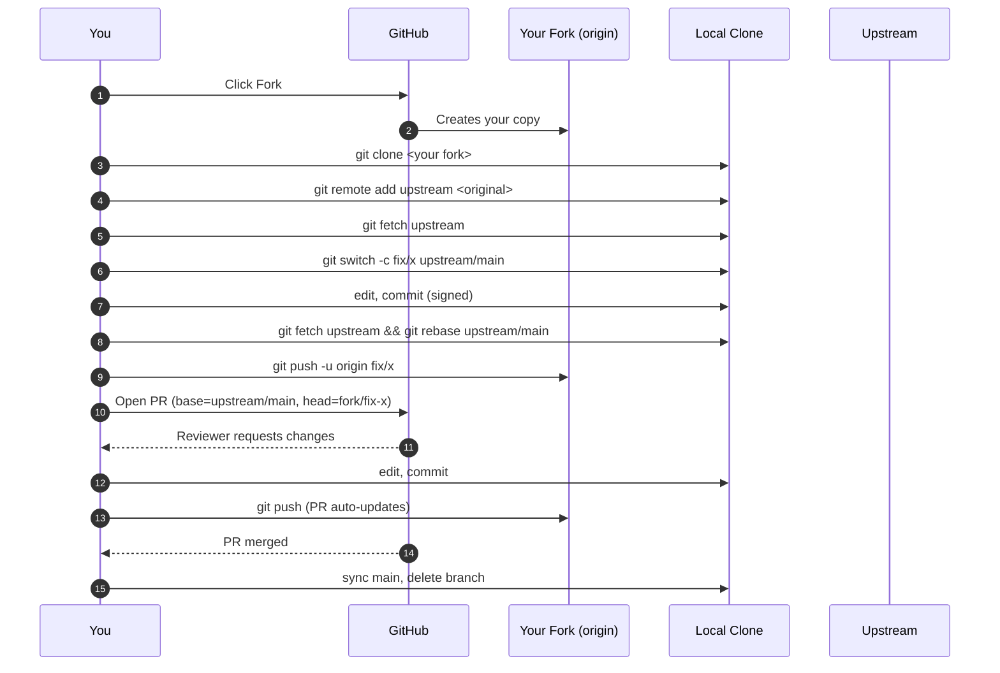

# 🌍 Contributing to Open Source — The Complete Guide

> The git mechanics are in [Day 3 §9](./day3-remote-github/notes.md#9-contributing-to-an-open-source-project---step-by-step).  
> **This guide** covers everything around them: how to find projects, write a PR that gets merged, handle review feedback, and grow from "first PR" to "trusted contributor."

---

## Why this guide exists

Almost every "how to contribute to open source" tutorial stops at `git push`. But the *git part is the easy part*. The hard parts are:

- Picking a project where your first PR isn't ignored
- Reading 100,000 lines of unfamiliar code well enough to fix one bug
- Writing a PR description maintainers actually want to read
- Surviving "could you change this?" feedback without taking it personally
- Knowing when to push back and when to just do what they ask

This guide is the part most contributors had to learn the hard way.

---

## 📍 Part 1 — Why contribute (be honest with yourself)

Pick a reason. It changes the projects you should target.

| Your reason | Best target projects |
|-------------|---------------------|
| **Learn a language / framework deeper** | Mid-size projects (1k–20k stars) — small enough to read, big enough to teach |
| **Build a portfolio for a job hunt** | Projects in the company's stack; bonus if they're used by that company |
| **Give back to a tool you love** | The exact tool — start with docs, then bugs |
| **Get hired by the project's company** | Their official OSS — many companies hire from regular contributors |
| **Build credibility / personal brand** | A few projects with high visibility, sustained over time |
| **Have fun / kill boredom** | Something delightful (games, art, generative tools, niche utilities) |

> ⚠️ "I want to contribute to React/Linux/Kubernetes as my first PR" — usually a bad idea. These projects have hundreds of contributors and very high standards. Start smaller, work up.

---

## 🔍 Part 2 — How to find your first project

### Strategy 1 — Start with what you already use

Look at the tools open on your laptop right now. Library, CLI, VS Code extension, browser plugin, blog generator, the editor you typed this in. Each one has a GitHub repo. **You already understand the user experience** — that's half the battle.

### Strategy 2 — Search GitHub for beginner-friendly issues

GitHub has labels for this. Try these URLs (replace the language):

- https://github.com/issues?q=is%3Aopen+is%3Aissue+label%3A%22good+first+issue%22+language%3Apython
- https://github.com/issues?q=is%3Aopen+is%3Aissue+label%3A%22help+wanted%22+language%3Ago

Standard labels:

| Label | Meaning |
|-------|---------|
| `good first issue` | Maintainers explicitly want a newcomer to take this |
| `help wanted` | Maintainers welcome any contributor (not newbie-only) |
| `documentation` | Docs improvements — lower bar than code |
| `up-for-grabs` | Same idea, older label |
| `hacktoberfest` | Tagged during October — usually low bar |

### Strategy 3 — Aggregator sites

- **firstcontributions.github.io** — curated beginner-friendly repos
- **goodfirstissue.dev** — searchable index of `good first issue` tickets
- **up-for-grabs.net** — same idea, different curation
- **github.com/explore** — trending and recommended repos based on your activity

### Strategy 4 — The "scratch your itch" rule

You're using a tool. It does something annoying. The fix is one PR. **This is the highest-conversion contribution path** — you're already motivated, you already know the bug exists, and you'll actually use your own fix.

### Healthy signals when choosing a project

Spend 5 minutes on the repo before committing time:

| Look at | Healthy | Red flag |
|---------|---------|----------|
| Last commit on `main` | Last few weeks | Last update was 18 months ago |
| Open PRs | Some merging, some discussion | 200 open PRs, none merged in 6 months |
| Open issues | Triaged, labeled | "Issues" page is a dumping ground |
| CI status on PRs | Green/red signals run | No CI configured |
| Maintainer responsiveness | Comments within days | Issues with no maintainer reply ever |
| `CONTRIBUTING.md` | Exists, clear | Missing entirely |
| Recent releases | Versioned regularly | No releases for years |

If 3+ red flags: pick another project. Your work will rot in their PR queue.

---

## 📜 Part 3 — Anatomy of a healthy OSS project

Every project has these files. Read them **before** writing any code.

| File | What's in it | What you do with it |
|------|--------------|---------------------|
| `README.md` | What the project is, install, quickstart | Understand the project's purpose |
| `CONTRIBUTING.md` | How to contribute | **Treat as the law.** Branch naming, PR style, tests required, commit format |
| `CODE_OF_CONDUCT.md` | Behavior expectations | Read it. Internalize it. |
| `LICENSE` | Legal terms | Confirms you're allowed to contribute and use the code |
| `SECURITY.md` | How to report vulnerabilities | If you find a security bug, **don't open a public issue** — follow this file |
| `CODEOWNERS` (`.github/CODEOWNERS`) | Who reviews which paths | Tells you who'll review your PR |
| `.github/ISSUE_TEMPLATE/` | Issue templates | Use them — don't open freeform issues |
| `.github/PULL_REQUEST_TEMPLATE.md` | PR template | Your PR description starts from this |
| `CHANGELOG.md` / `RELEASES` | What changed when | Helps you understand the project's recent direction |

If a project has no `CONTRIBUTING.md`, look at recent merged PRs to see the de facto style.

---

## 🛠 Part 4 — One-time setup

Get this right once, save hours forever.

### Git identity
```bash
git config --global user.name "Your Real Name"
git config --global user.email "you@example.com"
```
Use your real name and a real email. Some projects reject anonymous commits.

### SSH key (recommended over HTTPS+PAT for daily contributing)
```bash
ssh-keygen -t ed25519 -C "you@example.com"
cat ~/.ssh/id_ed25519.pub             # paste into github.com → Settings → SSH and GPG Keys
ssh -T git@github.com                 # test
```

### Sign your commits (raises trust + many projects require it)

Easiest path is **SSH commit signing** (no GPG headache):
```bash
git config --global gpg.format ssh
git config --global user.signingkey ~/.ssh/id_ed25519.pub
git config --global commit.gpgsign true
git config --global tag.gpgsign true
```
Then add the *same* public key to GitHub → Settings → **SSH and GPG Keys** → as a **Signing Key** (not just auth key). Future commits show "Verified" on github.com.

### GitHub CLI (`gh`) — saves you many browser trips
```bash
gh auth login                         # log in once
gh repo fork ORIG_OWNER/REPO --clone  # fork + clone in one command
gh pr create --fill --web             # open PR with prefilled fields
gh pr status                          # see all your PRs
gh pr checks                          # CI status for a PR
```

### Default branch behavior
```bash
git config --global init.defaultBranch main
git config --global pull.rebase true              # cleaner history
git config --global rebase.autosquash true        # fixup commits squash naturally
git config --global rerere.enabled true           # remember conflict resolutions
git config --global push.autoSetupRemote true     # 'git push' on a new branch auto-sets upstream
git config --global push.default current          # only push the current branch
git config --global fetch.prune true              # auto-clean deleted remote branches
```

These five lines remove 80% of daily friction.

---

## 🪜 Part 5 — The full mechanical flow (one-pager)

The detailed step-by-step lives in [Day 3 §9](./day3-remote-github/notes.md#9-contributing-to-an-open-source-project---step-by-step). The summary:



The whole loop, end-to-end:

```bash
# Once per project
gh repo fork ORIG_OWNER/REPO --clone
cd REPO
git remote add upstream https://github.com/ORIG_OWNER/REPO.git
git remote set-url --push upstream DISABLE   # block accidental upstream push

# Per contribution
git fetch upstream
git switch -c fix/short-clear-name upstream/main
# edit, run tests
git commit -s -m "fix: short imperative title"
git fetch upstream
git rebase upstream/main
git push -u origin fix/short-clear-name
gh pr create --fill --web                    # browse to verify base+head, then submit
```

---

## ✍️ Part 6 — Writing a PR that gets merged

This is where most first-time contributors lose. Code is fine; the PR description kills it.

### The 4-part PR description

```markdown
## What
One sentence: what does this PR do?

## Why
Why is this change needed? Link the issue: Closes #1234

## How
Brief technical summary of the approach. Anything non-obvious?

## Test plan
- [ ] Added unit test for X
- [ ] Manually verified Y in the dev server
- [ ] Existing tests still pass
```

That's it. Reviewers can decide in 60 seconds whether to dive in.

### What maintainers actually look for (in order)

1. **Is the problem real?** (Issue exists; bug reproduces; feature is wanted.)
2. **Is the scope right?** (Doesn't touch unrelated files; doesn't reformat the whole project.)
3. **Does it follow the project's patterns?** (Style, naming, tests, file structure.)
4. **Is the commit history clean?** (One logical commit, or a few well-named ones.)
5. **Does CI pass?** (Lint, unit tests, type checks, build.)
6. **Does the PR description make sense?**
7. **Is the actual diff correct?**

Notice the code is #7. That's not a joke. If 1–6 fail, the maintainer never gets to #7.

### Small PR > Big PR (almost always)

| Big PR (lose) | Small PR (win) |
|---------------|----------------|
| "I refactored everything and also fixed this bug" | "Fix typo in error message" |
| Touches 40 files, 2,000 lines | Touches 1 file, 5 lines |
| Sits in review for 6 weeks | Merged in 2 days |
| 47 review comments | 0 review comments |

Maintainers want **easy yes/no decisions**. A 5-line PR is an easy yes.

### Anti-patterns that get PRs closed

- "Drive-by formatting" — running prettier on the whole file you touched
- Adding a new dependency without discussion
- Refactoring "while I'm here"
- "Bumped node_modules" — unrequested dep updates
- Mixing fix + feature in one PR
- Reformatting line endings (CRLF/LF) silently
- Commits like `wip`, `fix`, `more changes`, `fixed comments`

### Commit message style

If unsure, follow **Conventional Commits**:

```
type(scope): short imperative description

(optional body explaining why)

(optional footers: Refs #123, Closes #456, BREAKING CHANGE: ...)
```

Types: `feat`, `fix`, `docs`, `style`, `refactor`, `perf`, `test`, `chore`, `build`, `ci`, `revert`.

Examples:
- `fix(parser): handle empty input gracefully`
- `docs: add migration guide for v3`
- `feat(auth): support GitHub OIDC for service tokens`

Use **imperative mood**: "fix bug", not "fixed bug" or "fixes bug".

---

## 🔁 Part 7 — Handling review feedback (the human part)

This is where the most learning happens — and where most contributors quit.

### Mindset

A reviewer asking for changes is **not** rejecting you. They're saying "we want to merge this, and here's what needs to change." That's the goal.

**Bad reactions** (we've all had them):
- "But it works on my machine!"
- "This is how everyone does it in <other framework>"
- "Why are you so picky about formatting"
- Ghosting the PR for 3 weeks because the feedback stung

**Good reactions:**
- "Good catch, fixed in <commit-sha>"
- "I'd like to keep this as-is because <specific reason>. Happy to change if you'd prefer."
- "Could you clarify what you mean by X? I want to make sure I do it right."
- "I've pushed the changes. Could you take another look when you have time?"

### When to push back

You *can* disagree. Maintainers are human. Push back when:

- The reviewer is asking for something that contradicts `CONTRIBUTING.md`
- The change would break a behavior you specifically need
- You have **data** (benchmark, test) that supports your choice

How:

> "I considered that approach but went with this one because [specific reason / benchmark / link]. Would you prefer I switch, or is the rationale enough?"

Specific + polite + open-ended = wins. Stubborn + defensive = loses.

### When the PR sits for weeks

Some maintainers are slow. Some are overwhelmed. Some have life happen.

- Wait 1 week from PR open: do nothing
- Wait 2 weeks: polite bump ("Hi! Friendly nudge in case this fell off your radar 🙂")
- Wait 4 weeks: bump again, tag the maintainer mentioned in `CODEOWNERS`
- Wait 2+ months: consider closing the PR with a note and moving on. Your time matters.

Never bump aggressively or multiple times a week. Most maintainers are unpaid volunteers.

### When a PR gets closed without merging

Happens. Reasons:

| Reason | What to learn |
|--------|---------------|
| "Out of scope" | Open an issue *first* next time to gauge interest |
| "Won't fix" / "By design" | The behavior you found a "bug" is intentional |
| "We solved this differently in #5678" | Look at what they merged and understand why |
| Silent close after weeks | Probably project abandonment or a personal beef. Don't take personally. |

**Save the diff.** You learned something writing it. The skill is yours even if the PR isn't merged.

---

## 🏆 Part 8 — After your first merged PR

A first-PR-merged dopamine hit is huge. Use it.

### Day-of
- Star the project (if you didn't already)
- Tweet/post: "Just landed my first PR in <project>!" — small but real signal to your network
- Add it to your portfolio / resume

### Week 1
- Pick **two more issues** in the same project. The activation energy for PRs 2+ is much lower than for PR 1.
- Watch the repo (GitHub → Watch → Releases or All Activity) — context compounds.

### Month 1
- Triage issues: reproduce bugs others report, ask clarifying questions. Maintainers love this.
- Review other people's PRs. You'll learn the project's standards faster than any other way.
- Look at `git shortlog -sn` in the project — see who the regulars are, who reviews PRs.

### Becoming a recognized contributor

Most projects have an unwritten path:

```
First PR → Few more PRs → Triage issues → Review PRs → 
  Sustained presence → Maintainer offers you commit access
```

This takes 6 months to 2 years for substantial projects. No shortcut.

### Maintaining a contribution streak

The hard part is consistency. Tactics that work:

- **One PR every 2 weeks** is more impressive than 30 PRs in one weekend
- Pick **2–3 projects max** to follow seriously
- Use your daily tools, fix what annoys you, send the fix
- Skip months when life is busy — no one is keeping score

---

## 🗂 Part 9 — Special workflows worth knowing

### Hacktoberfest (October)

Annual event where contributing PRs earn a swag prize. **Good for first-timers**, but maintainers also see a flood of low-quality "fix typo" spam. If you do it, do it well — pick `hacktoberfest`-labeled repos that want serious contributions.

### Google Summer of Code (GSoC) & Outreachy

Paid, mentored programs (~3 months) where students contribute to OSS projects. Applications are competitive but a deliberate-practice setup.

### DCO sign-off vs CLA

Some projects require you to certify origin/license of your contribution:

- **DCO (Developer Certificate of Origin)** — sign each commit with `-s`:
  ```bash
  git commit -s -m "fix: bug"
  # adds: Signed-off-by: Your Name <you@example.com>
  ```
- **CLA (Contributor License Agreement)** — a one-time legal agreement, often via a bot that comments on your first PR. Read it before signing.

### Sponsorship (GitHub Sponsors / Open Collective)

Maintainers can be paid. If a project saves you real money, sponsor it. Even $5/month signals. Some companies will reimburse this.

### Becoming a maintainer

If invited:
- You now have power over a community space — go slowly
- Read other maintainers' decisions before reversing them
- Be more polite in review than you'd expect to receive
- Establish a **release cadence** and stick to it
- Remember every contributor was once where you were

---

## 🚑 Part 10 — Failure modes and how to recover

### "I pushed sensitive data to my PR branch"

```bash
# Rotate the secret IMMEDIATELY (assume it's leaked)
# Then rewrite history:
git rebase -i upstream/main           # drop the bad commit, or
git filter-repo --path file.env --invert-paths
git push --force-with-lease origin <branch>
```
If the PR was already merged: open an issue with the maintainer; they may rewrite upstream history with you.

### "I rebased and made it worse"

```bash
git reflog                            # find the commit before the rebase
git reset --hard <sha-from-reflog>
```
`reflog` is your undo button. It's always there.

### "I committed to upstream/main by accident"

Can't happen if you `git remote set-url --push upstream DISABLE` (Step 3 in setup). Do that.

If you did it via a clone of upstream (not your fork): the push will fail with "Permission denied." No harm done — just `git push origin ...` instead.

### "I lost track of which fork is mine"

```bash
git remote -v
# If origin still points at upstream, you cloned the wrong thing.
# Fix in place:
gh repo fork --remote
# OR delete and re-clone your fork
```

### "A maintainer asked me to squash 12 commits into 1"

```bash
git fetch upstream
git rebase -i upstream/main
# In editor: change all but the first 'pick' to 's' (squash)
# Save → edit the combined message → save
git push --force-with-lease origin <branch>
```

### "The PR has merge conflicts"

```bash
git fetch upstream
git rebase upstream/main
# Git stops on each conflict:
#   - edit the file to resolve (remove <<< === >>> markers)
#   - git add <file>
#   - git rebase --continue
git push --force-with-lease origin <branch>
```

### "I accidentally force-pushed to the wrong branch"

If the branch was on a public repo and someone else had it locally:
- Apologize on the PR
- Tell them how to recover: `git fetch && git reset --hard origin/<branch>` (warn them this discards local work)
- Going forward, **always** use `--force-with-lease` — it would have prevented this

---

## 🧭 Part 11 — A 30-day plan

If you have nothing else and want to start *today*:

| Day | Action |
|-----|--------|
| 1 | Pick 3 tools you use daily. Find their GitHub repos. |
| 2 | Look at each repo's `CONTRIBUTING.md`, `good first issue` filter, last commit date. Pick **one**. |
| 3 | Run the project locally. Get the tests passing. |
| 4 | Read 5 recently-merged PRs in the project. Notice the style. |
| 5 | Pick one issue tagged `good first issue` or `docs`. Comment "I'd like to work on this" if convention requires it. |
| 6–10 | Implement the fix. Commit cleanly. Push to your fork. Open PR. |
| 11 | Wait for review. Triage another project's issues while you wait. |
| 12–14 | Respond to review feedback. Iterate. |
| 15 | PR merged (or closed with feedback — learn either way). |
| 16–30 | Pick 2–3 more issues in the same project. Build the muscle. |

After 30 days you'll be ahead of 99% of people who say "I'll contribute to OSS someday."

---

## 🎓 Resources

- **firstcontributions.github.io** — interactive tutorial
- **opensource.guide** — GitHub's own guide
- **github.com/freeCodeCamp/how-to-contribute-to-open-source** — curated list
- **The Architecture of Open Source Applications** (free book) — read one chapter
- **github.com/forem/forem** & **github.com/home-assistant/core** — friendly projects with many beginner issues
- **github.com/EddieHubCommunity** — newcomer-friendly community

---

## ✅ TL;DR

1. Pick a small project you already use
2. Read its `CONTRIBUTING.md` like it's the law
3. Find a `good first issue` — or fix something that annoys you
4. **Fork → clone your fork → branch off upstream → small commit → rebase → push → PR**
5. Write the PR description like the maintainer is busy (they are)
6. Respond to feedback graciously, even when it stings
7. Repeat. The 2nd PR is 10× easier than the 1st.

**The git commands are mechanical. The skill is everything around them.**

Now go ship a PR.

---

← [Back to Day 3](./day3-remote-github/notes.md) · [Interview Questions](./interview-questions.md) · [Main README](./README.md)
